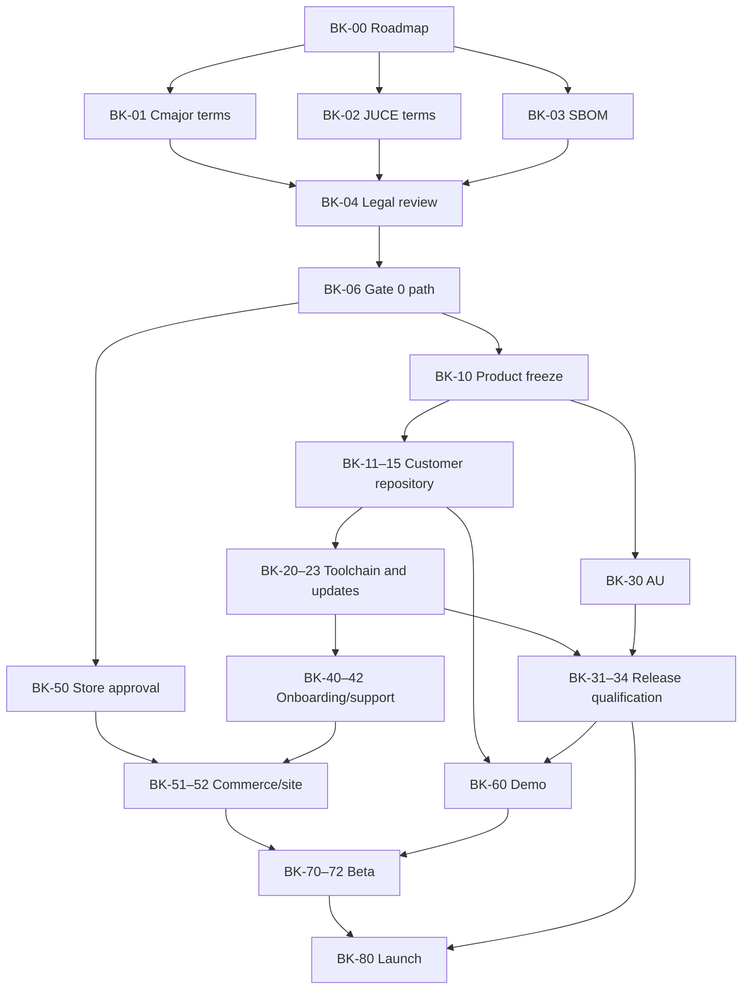

# Enhancer Lite Builder Kit — Product, GTM, and Release Roadmap

Status: **execution-grade plan; Gate 0 unresolved**

Date: 2026-08-27

Planning branch: `codex/enhancer-lite-builder-kit-roadmap`

Source baseline inspected: `origin/master@6dbc94884b173d66c3885e991faeff541bcf0091`

Historical DSP checkpoint: `codex/t26-spectre-wrapper-prototype@2a652a4035519be1fbe12de9a8c6487ed736e3c5`

This document defines the smallest credible macOS launch of the free Cosimo Enhancer Lite plugin and its paid, agent-editable Builder Kit. It is the task and decision authority for that launch plan only. It does not change the fixed two-band T26 Enhancer, the per-voice T62 Enhancer, the T28 Polish chain, or their product contracts.

The roadmap is intentionally gated. The current plugin is a strong development prototype, but the commercial Builder Kit promise is not yet legally or operationally qualified.

## 1. Executive decision

### Product

Name: **Enhancer Lite Builder Kit**

Descriptor: *The finished plugin, plus all the building blocks to make it your own.*

The public funnel has two products:

1. **Free Cosimo Enhancer Lite:** a genuinely useful, finished macOS audio effect.
2. **Paid Builder Kit:** a clean, editable plugin project that a musician can hand to a coding agent, build locally, modify, test, and install.

The founding offer is **$29 for the first 50 buyers**, including lifetime access to upstream kit releases. A later **$49** price is only a hypothesis and requires activation, support, and customer-example evidence.

### Target buyer

A Mac-based musician or producer who already uses, or is willing to use, a filesystem-capable coding agent; has imagined changing a plugin; and has not successfully built one before. The initial buyer wants creative ownership without first learning C++, CMake, signing, and DAW packaging.

### Observable promise

A buyer can give the downloaded kit and its setup prompt to the supported reference agent, get the baseline plugin built and installed, request one bounded DSP/UI modification, rebuild it under a collision-safe identity, and use the result in a supported DAW.

### Gate 0: commercial-rights go/no-go

Do **not** publicly promise that buyers may commercially distribute proprietary derivatives until Cmajor and JUCE provide written terms supporting this exact source-kit model, or qualified counsel confirms another compliant route.

Current evidence:

- Cmajor is dual GPLv3/commercial. Its official terms say generated C++ from a customer's own Cmajor source is theirs to use, but closed-source products embedding Cmajor code or engine components require commercial licensing. The generated JUCE wrapper and customer-modification workflow need written classification. [Cmajor licensing](https://cmajor.dev/docs/Licence) · [Cmajor repository license](https://github.com/cmajor-lang/cmajor/blob/main/LICENSE.md)
- JUCE is dual AGPLv3/commercial. The current JUCE 9 EULA separately restricts “Products That Create Products” without an alternative agreement. A paid source kit designed to create derivative plugins needs written JUCE clearance. [JUCE licensing](https://juce.com/get-juce/) · [JUCE 9 EULA](https://juce.com/legal/juce-9-licence/)
- The current repository has no root customer license and therefore grants no explicit source modification or redistribution rights.

Required written question to both licensors:

> May Cosimo sell an editable source kit to an unlimited number of individual customers, allow each customer and their coding agent to modify the Cmajor/JUCE-dependent project, and allow each customer to compile, rename, sign, distribute, and sell proprietary derivative plugins without Cosimo purchasing a developer seat for every customer?

If the answer is no or economically unreasonable, Andrew chooses one fallback before further launch investment:

1. **Open-source kit:** GPL/AGPL-compatible source and derivative obligations; buyers may also redistribute the underlying kit.
2. **Personal-use kit:** paid editing/building workflow, but no promise of proprietary commercial distribution.
3. **Permissive wrapper:** replace the Cmajor/JUCE-dependent customer build path; highest engineering cost, strongest long-term commercial freedom.
4. **Do not launch the Builder Kit:** release the free plugin only and retain the work internally.

## 2. Locked decisions, recommendations, and unresolved gates

| Topic | Status | Decision or recommendation | Consequence |
|---|---|---|---|
| Name | Locked | `Enhancer Lite Builder Kit` | Use consistently in planning and customer copy, subject to trademark clearance. |
| Descriptor | Locked | “The finished plugin, plus all the building blocks to make it your own.” | Avoid generic “AI plugin generator” positioning. |
| Headline | Provisional | “Your first plugin is already built.” | Test against the hero demonstration before GA. |
| Free product | Locked | Full Enhancer Lite binary; not intentionally crippled. | The paid product sells ownership and workflow, not missing sound features. |
| Paid product | Locked | Sanitized editable project, setup/update prompts, build system, onboarding, Wavefold example, and lifetime upstream releases. | Never ship the Cosimo monorepo or its full history. |
| Founding price | Locked for validation | $29, first 50 buyers. | Maximum gross revenue is $1,450; this is a validation cohort, not a profit proof. |
| Later price | Hypothesis | $49 after evidence. | No automatic increase after customer 50; require the Gate 6 metrics. |
| Platforms | Locked | macOS desktop only; Apple Silicon and Intel. | No Windows or Linux in v1. |
| Formats | Locked target | VST3 and macOS AU component. | AU/Logic claims remain blocked until a real AU passes Gate 3. |
| Official hosts | Locked target | Ableton Live for VST3 and Logic Pro for AU. | Other macOS hosts are best effort. If AU misses the gate, launch scope must be explicitly reduced before publication. |
| Host automation | Unresolved human choice | The current Lite endpoints are saved but deliberately non-automatable. | Andrew must accept that limitation for v1 or authorize a separate automation/state migration before product freeze. |
| Standalone Lite behavior | Locked | Preserve current master composition: Low/Bell/High, Stereo/M/S, independent Mid/Side amounts, Tube/Solid, Subtle/Medium, aligned analyzer, direct graph/readout gestures, no de-emphasis circuit. | This is separate from T26 and T62. |
| MIDI tracking | Excluded from Builder Kit v1 | No MIDI/key tracking. | Current T61 says otherwise; reconcile the tracker before implementation. |
| iOS AUv3 | Excluded from Builder Kit v1 | No iPhone/iPad product. | Current T61 includes iOS; it remains a separate product task. |
| Example modification | Locked | Add Wavefold and a distinct solid-color visual identity; invite buyers to ask their agent for another algorithm. | Ship a reproducible completed reference branch plus the starting prompt. |
| Free download | Locked | Email-gated lead magnet. | Show HN is not a launch priority because it favors barrier-free trials. Marketing consent still requires legal review. |
| Checkout | Recommended and researched | Lemon Squeezy merchant-of-record. | Use one-time product, lead magnet, license keys, secure files, My Orders recovery, and replacement files for lifetime releases. |
| License key use | Locked recommendation | Purchase/update entitlement only; no runtime plugin activation. | Do not add DRM or require the free/modified plugin to call home. |
| Source delivery | Locked recommendation | Versioned private release archive containing a Git bundle; no GitHub membership automation. | Customer clones locally and owns a customization branch. Lemon Squeezy is the private update channel, not a Git remote. |
| Updates | Locked definition | Lifetime access to new upstream release bundles, not lifetime bespoke merge support. | Update prompt checkpoints, imports, rebases, tests, and installs only on success. Conflicts may require customer action. |
| Supported agent | Recommendation awaiting Andrew | Codex is the reference workflow; other filesystem-capable coding agents are best effort until beta evidence expands support. | Limits support surface while keeping the source ordinary and portable. |
| Support | Locked direction | Self-service diagnostics and documentation; minimal community Discord only if repeated demand appears. | No promised one-to-one development consulting. |
| Acquisition | Locked | Free plugin coverage → email/download → modification demo → Builder Kit purchase. | No paid ads before organic conversion evidence. |
| Founder visibility | Unresolved human choice | Andrew appears or narrates the modification story, or an equally credible alternative is produced. | The video must still show the real workflow and not a fictional one-click build. |
| Telemetry | Excluded from v1 plugin | No hidden plugin or source-kit telemetry. | Use Lemon events, explicit surveys, and personal beta follow-up for activation evidence. |

## 3. Scope and non-goals

### Minimum valuable slice

The minimum valuable slice is a finished macOS Enhancer Lite effect plus a clean editable project that lets a minimally technical musician use the reference coding agent to install the baseline, make one bounded DSP/UI change, recover from failure, and keep receiving upstream release bundles without destroying local changes.

### Explicitly excluded from v1

- Windows, Linux, VST2, AAX, CLAP, and iOS AUv3.
- MIDI or per-note pitch tracking.
- The fixed two-band T26 Enhancer, T28 Polish chain, and per-voice T62 implementation.
- A hosted prompt-to-plugin generator.
- A plugin marketplace, public remix registry, or agentic in-DAW runtime.
- A large algorithm catalog.
- Guaranteed compatibility with every coding agent, DAW, Xcode version, or future upstream framework release.
- Paid ads, affiliate administration, or a large Discord operation before conversion evidence.
- Runtime license activation, background telemetry, or a custom account system.
- Shipping the complete Cosimo repository, private history, Spectre corpus, user audio, unreleased synth code, internal plans, or unrelated dependencies.
- Guaranteed automatic resolution of update conflicts.
- Cosimo signing or notarizing arbitrary customer-authored derivatives.

## 4. Release product contract

### 4.1 Free Cosimo Enhancer Lite

Release contents:

- Universal macOS VST3.
- Universal macOS AU component after it passes Gate 3.
- Signed and notarized installer package.
- Checksums, release manifest, versioned release notes, third-party notices, install instructions, and uninstall instructions.
- No source project and no license activation.

Required retained behavior from current master:

- One frequency-selective shape: Low, Bell, or High.
- Stereo or Mid/Side routing.
- Independent Mid and Side Amounts in M/S mode.
- Frequency, Q, Tube/Solid Character, and Subtle/Medium Intensity.
- Four-times short polyphase-IIR oversampling and truthful three-sample latency.
- No de-emphasis path.
- Direct graph editing and draggable Frequency, Amount/Mid, Side, and Q readouts.
- Logarithmic Frequency and Q gesture laws.
- Before/after analyzer aligned to the response graph.
- Solid-black neon base interface and packaged Enhancer Lite wordmark.
- Saved state, control smoothing, finite output, mono/stereo coherence, zero-effect dry behavior, and the accepted shelf/audio corpus.

Public release claims must be regenerated from the final release commit. Historical pluginval, Ableton, Spectre, measurement, and checksum evidence cannot substitute for final artifact provenance.

### 4.2 Paid Builder Kit

The purchased download contains:

- The same finished VST3/AU installer as the free product.
- `enhancer-lite-builder-kit-<version>.bundle`: a sanitized Git bundle with release tags and no private Cosimo history.
- `START-HERE.md`: the single copied setup prompt and a plain-language fallback path.
- `README.md`, `AGENTS.md`, `BUILDING.md`, `MODIFYING.md`, `UPDATING.md`, `PUBLISHING.md`, `TROUBLESHOOTING.md`, and `SUPPORT.md`.
- `onboarding/index.html`: a local, branded welcome page opened after a successful setup.
- Deterministic `doctor`, `setup`, `test`, `build`, `install`, `configure`, `update`, and `recover` commands.
- A completed `examples/wavefold` reference branch/tag, its prompt, focused tests, and before/after audio.
- Customer-facing focused tests that do not require proprietary reference corpora or the Cosimo monorepo.
- Product license, third-party notices, dependency lock, and actual-build software bill of materials.

The kit license and customer promise depend on Gate 0. Whatever model is selected must state plainly:

- What the buyer may modify.
- Whether the buyer may publish source.
- Whether the buyer may distribute or sell compiled derivatives.
- Which dependencies require the buyer's own license.
- What branding and identifiers must be replaced.
- What “lifetime updates” includes and excludes.
- That coding-agent subscriptions, Apple Developer membership, signing identities, and third-party fees are not included.

### 4.3 Customer project identity

One checked-in `product.json` is the source of truth for:

- Product and manufacturer names.
- Bundle identifier.
- four-character plugin and manufacturer codes.
- Semantic version.
- Output filenames and install paths.
- Wordmark/logo paths and UI accent/background tokens.
- Copyright and support URLs.

`npm run configure` must:

1. Preserve the pristine upstream release tag.
2. Ask for or accept the new product/manufacturer identity.
3. Generate valid collision-resistant identifiers and validate four-character codes.
4. Replace Cosimo marks in customer-facing binaries and resources when publishing mode is selected.
5. Create a recovery commit before changing generated files.
6. Refuse an identity that collides with the original or an already installed kit project.

Personal local experimentation may retain the Cosimo identity, but a distributable derivative may not.

### 4.4 Build and signing modes

The project distinguishes two modes:

- **Local mode:** deterministic universal build, ad-hoc signing, user-level installation, and supported-host smoke on the customer's Mac. This is the core activation path.
- **Distribution mode:** customer-specific identity, Developer ID Application/Installer signing, hardened-runtime review, notarization, stapling, distributable installer, and clean-machine verification. This requires the customer's own Apple Developer credentials and only ships if Gate 0 permits commercial derivatives.

Cosimo's Apple certificates, Lemon Squeezy credentials, notary credentials, and signing secrets never enter the customer repository, release archive, logs, prompts, or support bundles.

Apple requires Developer ID signing and notarization for trustworthy distribution of downloaded macOS plug-ins and installer packages. [Apple notarization](https://developer.apple.com/documentation/security/notarizing-macos-software-before-distribution) · [Apple packaging](https://developer.apple.com/documentation/xcode/packaging-mac-software-for-distribution)

## 5. Customer journeys

### 5.1 Free plugin

1. Visitor reaches the landing page through a review, product database, video, press item, or referral.
2. Visitor chooses the free Enhancer Lite download and sees the exact macOS/DAW requirements.
3. Lemon Squeezy collects the delivery email and legally reviewed marketing consent.
4. Visitor receives the current signed/notarized installer and checksum.
5. Installer places VST3 and AU in standard user locations.
6. The user rescans/restarts the host if required and loads the plugin.
7. The success page and plugin About panel present a restrained “Make it yours” link.

Failure behavior:

- Unsupported OS/architecture is shown before download.
- Expired download access is recoverable through Lemon Squeezy My Orders.
- A failed installer provides a diagnostic log and manual uninstall path.
- A missing host scan is documented without claiming the install failed.

### 5.2 Paid setup

1. Buyer purchases the founding Builder Kit.
2. Lemon Squeezy issues the entitlement/license key and exposes the versioned files in My Orders.
3. Buyer downloads the finished installer and Git bundle, then copies the setup prompt.
4. The agent locates the downloaded bundle, verifies its published checksum, clones it locally, and creates `customer/main` from the release tag.
5. `doctor` inventories the machine without changing it and explains missing requirements in plain language.
6. With permission, `setup` installs only the documented build tools and pinned dependencies.
7. `test`, `build`, and `install` produce and install the baseline local-mode plugin.
8. The agent confirms the installed path and asks the user to perform the supported-host smoke.
9. Onboarding HTML opens and explains modification, recovery, updates, publishing limits, and support.

The agent must stop—not improvise—when licensing terms are unaccepted, required Apple/Xcode agreements need human interaction, a checksum fails, or an unsupported environment is detected.

### 5.3 First modification

1. Agent creates a named recovery checkpoint and modification branch.
2. User describes one algorithm and optional visual identity change.
3. Agent identifies affected DSP, state, UI, and test seams before editing.
4. Agent writes or updates focused tests, implements the change, and runs finite-output, dry, state, UI, and audio checks.
5. Agent builds and installs only after tests pass.
6. User auditions the result in a supported host and either keeps it or asks the agent to recover.

The launch example adds Wavefold plus a distinct solid-color treatment. Marketing must show an edited 90-second hero cut **and** an honestly timed longer workflow; it must not imply that arbitrary changes always finish in 90 seconds.

### 5.4 Update while preserving customer changes

1. Customer obtains the latest signed Git bundle through My Orders.
2. Update prompt verifies the bundle checksum and the local repository state.
3. Agent commits or archives every local change and creates a recovery branch/tag.
4. Agent fetches the new immutable upstream release tag from the bundle.
5. Agent rebases the customer customization branch onto the new tag.
6. On conflict, the operation stops with the original branch and working build intact; no plugin is installed.
7. After a clean or deliberately resolved rebase, the complete customer test gate runs.
8. Only a green build is installed. The prior installed version remains recoverable.

Lifetime updates mean access to these upstream bundles. They do not guarantee conflict-free rebases or bespoke repair of every customer modification.

### 5.5 Publish a derivative

This flow is disabled in copy and tooling until Gate 0 passes.

When enabled:

1. Customer accepts the applicable Cosimo and third-party terms.
2. `configure` proves non-Cosimo identity and unique plugin codes.
3. `doctor --distribution` verifies the customer's own Apple membership, identities, and notarization configuration without exposing secrets.
4. Release tests and license/notice generation pass.
5. Customer's machine signs, packages, notarizes, staples, and verifies the derivative.
6. A clean account or clean Mac validates Gatekeeper, VST3, AU, state recall, and uninstall.

Cosimo does not sign, notarize, host, endorse, or assume responsibility for arbitrary customer DSP in v1.

## 6. Technical boundary and repository architecture

### 6.1 Canonical sources

- Future release engineering starts from current master after the coordinator's composed shelf/readout commits, not from historical `2a652a40`.
- The Builder Kit release repository is generated from an explicit allowlist and reviewed as its own product.
- The export fails if a file is unclassified, a forbidden path enters the bundle, a license is missing, or a generated file lacks provenance.

Forbidden customer content includes internal TODO/progress files, other Cosimo products, Spectre captures and ignored corpora, private research notes, user audio, unrelated build tools, installed artifacts, secrets, caches, and complete monorepo history.

### 6.2 Proposed customer repository

```text
enhancer-lite-builder-kit/
  AGENTS.md
  README.md
  LICENSE.md
  THIRD_PARTY_NOTICES.md
  product.json
  toolchain.lock.json
  package.json
  package-lock.json
  dsp/
  plugin/
  ui/
  assets/
  tests/
    dsp/
    state/
    ui/
    audio/
    fixtures/
  scripts/
    doctor.*
    setup.*
    configure.*
    build.*
    test.*
    install.*
    package.*
    update.*
    recover.*
  docs/
    BUILDING.md
    MODIFYING.md
    UPDATING.md
    PUBLISHING.md
    TROUBLESHOOTING.md
    SUPPORT.md
  onboarding/
    index.html
    assets/
  examples/
    wavefold/
  sbom/
```

### 6.3 Toolchain contract

`toolchain.lock.json` pins versions, commits, download URLs, and checksums for every build dependency. At minimum:

- Stable Xcode and Command Line Tools range.
- macOS deployment target.
- Node and npm.
- CMake.
- Cmajor CLI and source/runtime commit.
- Patched CHOC commit, if still required.
- JUCE major/minor and exact commit.
- VST3 SDK and other transitive wrapper dependencies.

The current repository pins Cmajor and CHOC but takes `cmaj` from `PATH` and shallow-clones moving JUCE. That is development behavior and fails the customer reproducibility gate.

### 6.4 Command contract

| Command | Required behavior |
|---|---|
| `doctor` | Read-only inventory; identifies OS, architecture, disk, Xcode agreement, Node/npm, CMake, Cmajor, JUCE, agent, DAW paths, signing mode, and unsupported conditions. Emits a redacted support report. |
| `setup` | Installs/fetches only pinned dependencies after consent; verifies checksums and licenses; is safe to rerun. |
| `test` | Runs customer-contained DSP, finite-output, dry, state, UI, audio, and build-contract tests. No proprietary corpus or network required after setup. |
| `build` | Produces deterministic universal local-mode VST3/AU artifacts from a clean tree. |
| `install` | Backs up/replaces only the exact target plugin bundles, signs locally, verifies, and prints rescan/restart instructions. |
| `configure` | Creates customer identity from `product.json`, validates collisions, removes publishing-forbidden Cosimo marks, and checkpoints first. |
| `package` | Builds a customer-signed distribution artifact only when distribution prerequisites and Gate 0 policy permit it. |
| `update` | Imports an authenticated upstream Git bundle, checkpoints, rebases, tests, and installs only on success. |
| `recover` | Restores a named code/install checkpoint without deleting unrelated customer work. |

All mutating commands support `--dry-run`, state their exact targets, refuse broad paths, and avoid storing secrets.

### 6.5 Test separation

Two test layers are required:

1. **Internal qualification:** retains Spectre comparison, complete accepted audio corpora, benchmark evidence, pluginval, host validation, and private release checks inside Cosimo.
2. **Customer gate:** self-contained tests of the shipped DSP/UI/state/build contract and safe modification behavior.

The current shelf-corpus test points at the ignored `build/t26-spectre-shelves` measurement corpus, and `ui/shared/enhancer-lite-state.ts` imports shared mode/curve vocabulary from the two-band state module. Both dependencies must be audited and severed before customer export. Customer tests may use newly authored redistributable fixtures and summarized numeric tolerances, never private reference audio.

## 7. Commerce and entitlement

### 7.1 Provider

Use Lemon Squeezy for v1, subject to account/store approval and one complete test purchase.

Verified current capabilities:

- Merchant-of-record handling for checkout and sales-tax/VAT collection.
- One-time digital products.
- Secure downloadable files.
- Generated license keys visible in receipts and My Orders.
- Existing buyers receive current replacement files when a product is updated.
- Lead-magnet products for the free-plugin funnel.
- Customer recovery through email magic link.
- Base transaction fee of 5% + $0.50, with additional fees possible for international/PayPal payments and payouts.

[Lemon Squeezy pricing](https://www.lemonsqueezy.com/pricing) · [Products and updates](https://docs.lemonsqueezy.com/help/products/adding-products) · [My Orders](https://docs.lemonsqueezy.com/help/online-store/my-orders)

Lemon Squeezy does not provide a private Git remote or preserve customer branches. For v1, My Orders is the private update channel and the downloaded Git bundle is the update transport.

### 7.2 Product catalog

| Product | Price | Entitlement | State at launch |
|---|---:|---|---|
| Cosimo Enhancer Lite | Free | Current signed/notarized installer and release notices | Active |
| Enhancer Lite Builder Kit — Founding | $29 one time | Current Builder Kit bundle plus lifetime upstream releases | Active; hard cap 50 |
| Enhancer Lite Builder Kit | $49 one time | Same entitlement | Disabled until Gate 6 evidence |

### 7.3 Data and consent

- Lemon Squeezy is the source of truth for purchase, refund, license key, and download entitlement.
- Cosimo's mailing system may receive customers only under the final privacy/consent policy.
- Transactional delivery and marketing messages are treated separately unless counsel approves another lawful basis.
- No license key is embedded in a public URL, persistent repository, support log, or reusable prompt.
- Refunds disable future paid-file entitlement where supported, but cannot revoke already downloaded source; the policy must say this honestly.
- KYC/KYB, payout identity, banking, tax treatment, privacy notice, refund policy, and marketing consent require Andrew's human completion and approval.

Recommended founding refund promise, pending counsel and Lemon policy review:

> If the supported reference agent cannot get the unmodified baseline built and installed on a declared supported Mac after the documented diagnostics, request a refund within 14 days.

This does not promise support for arbitrary modifications or commercial publishing.

## 8. Go-to-market system

### 8.1 Acquisition funnel

```text
Free-plugin discovery
        ↓
Enhancer Lite landing page and honest sound/UI proof
        ↓
Email-gated free download
        ↓
Installed plugin + “Make it yours” invitation
        ↓
Wavefold modification demonstration
        ↓
$29 founding Builder Kit
        ↓
Successful customer modifications and permissioned stories
```

The free plugin is the acquisition product. The Builder Kit is the paid conversion. Do not launch the paid source kit cold.

### 8.2 Discovery channels

Primary launch distribution:

- KVR developer product listing and factual launch-news submission. [KVR submissions](https://www.kvraudio.com/submissions/)
- Editorial pitches to Bedroom Producers Blog, Rekkerd, Audio Plugin Guy, and comparable free-plugin/news outlets.
- Advance access for 20–30 small, relevant music-production, audio-development, and agent-workflow creators.
- The owned full workflow video, cut into focused short clips.
- A legitimate educational contribution or partnership pitch to The Audio Programmer community, not drive-by link spam. [The Audio Programmer](https://www.theaudioprogrammer.com/)

Secondary only after initial proof:

- Search-oriented articles and videos such as “Build your first VST with a coding agent” and “Modify a real audio plugin without learning C++ first.”
- Customer modification features.
- Product Hunt for the source/agent story.

Defer Show HN while the free download is email-gated. Defer affiliates and paid ads until organic funnel conversion is measured.

### 8.3 Launch assets

- 90-second edited hero transformation: stock plugin → Wavefold request → visible DSP/UI change → rebuilt plugin in Ableton.
- An uncut or honestly timed longer walkthrough showing setup, tests, build, install, and audition.
- Before/after audio on representative drums, bass, synth, and full mix material with loudness-matched presentation.
- Product screenshots in Bell/Stereo, Bell/M/S, Low, High, and Wavefold-example states.
- Press kit: factual description, formats, system requirements, pricing, availability, screenshots, wordmark, demo links, support link, and direct download/purchase links.
- Landing page, FAQ, license summary, privacy notice, refund terms, and support boundaries.
- Free-delivery email and one Builder Kit follow-up showing the modification story.
- Beta/customer examples only with explicit permission for name, quote, prompt, screenshot, and audio.

Hero copy must sell the ability to modify a real plugin, not AI magic or Spectre reverse engineering. Spectre research can support a later engineering story after provenance and brand review.

## 9. Metrics and decision rules

### 9.1 Founding beta gate

Ten target users receive the kit without payment and without Andrew silently repairing their machines.

- At least 8/10 build and install the baseline.
- At least 6/10 complete one self-chosen modification.
- Every repeated setup failure is fixed or explicitly declared unsupported.
- At least 3 permissioned quotes/examples exist before public launch; 5 is preferred.
- Median and worst-case support time are recorded.

### 9.2 First 60-day targets

These are planning targets, not forecasts:

| Metric | Definition | Target |
|---|---|---:|
| Qualified free acquisition | Completed free checkout with installer available | 1,500 |
| Free download completion | Free checkout → binary downloaded | Record baseline; no invented target before launch |
| Builder conversion | Free downloader → paid purchase within 60 days | 50 founding purchases; approximately 3–4% working hypothesis |
| Baseline activation | Paid buyer reports baseline installed within seven days | At least 30/50 |
| First customization | Paid buyer reports first modification within seven days | At least 30/50 aspirational; investigate if below 15/50 |
| Permissioned proof | Customer permits a quote, screenshot, prompt, or audio example | At least 10 |
| Refunds | Refunded founding orders / founding orders | Under 10% |
| Support economics | Median and worst-case support minutes per buyer | Measure; no $49 launch if routine setup needs bespoke intervention |

Without plugin telemetry, activation comes from a short seven-day survey and personal founding-cohort follow-up. Never infer successful installation from a download event.

### 9.3 Diagnostic interpretation

- Low landing traffic: distribution or content problem.
- Traffic but low free checkout: free-plugin positioning, trust, compatibility, or email-friction problem.
- Free downloads but low paid conversion: Builder Kit promise, demo, price, or licensing limitation problem.
- Purchases but failed baseline setup: packaging/toolchain/onboarding problem.
- Baseline success but few modifications: modification workflow or target-customer problem.
- Successful modifications but no permissioned stories: weak social proof loop or inappropriate sharing request.
- High support time or refunds: do not scale reach or raise price.

## 10. Work breakdown structure

Owner codes:

- **A:** agent-owned implementation/research in an isolated worktree.
- **H:** human-only decision, credential, audition, relationship, or legal act.
- **A/H:** agent prepares and verifies; human approves or performs the irreducible action.

| ID | Work item | Owner | Depends on | Deliverable and completion test | Estimate |
|---|---|---|---|---|---:|
| BK-00 | Lock roadmap | A/H | — | This document committed on its dedicated current-master branch; Andrew approves material product decisions. | 1–2 d |
| BK-01 | Cmajor builder/OEM inquiry | H | BK-00 | Written answer covering editable kit, agent contributors, proprietary derivatives, seats, generated C++, lifetime versions, and distribution. | External |
| BK-02 | JUCE builder/OEM inquiry | H | BK-00 | Written answer covering source kit, “Products That Create Products,” customer contributors, derivative distribution, seats, and framework delivery. | External |
| BK-03 | Dependency and asset SBOM | A | BK-00 | Complete file-to-license inventory from the proposed customer allowlist; actual-build SBOM; missing terms identified. | 2–3 d |
| BK-04 | Legal/provenance review | H | BK-01–03 | Counsel-approved Cosimo source license/EULA, third-party obligations, Spectre provenance position, warranty/support limits, and refund terms. | External |
| BK-05 | Name/trademark clearance | H | BK-00 | Search and counsel/business decision for Cosimo Enhancer Lite and Builder Kit naming; conflicting “Enhancer Lite” products considered. | External |
| BK-06 | Choose Gate 0 path | H | BK-01–05 | Written choice: proprietary, open-source, personal-use, permissive wrapper, or no Builder Kit. Public promise updated accordingly. | 0.5 d |
| BK-07 | Reconcile repo task authority | A/H | BK-06 | Decide whether this is a new release ticket or a Builder Kit subset; record that v1 excludes T61's iOS/MIDI requirements without altering T26/T62. | 0.5 d |
| BK-10 | Freeze release feature contract | A/H | BK-06–07 | Current master composition enumerated and state/ID/version contract frozen; Andrew approves sound, controls, shelves, analyzer, gestures, wordmark, and no-MIDI stance. | 1 d |
| BK-11 | Create sanitized export | A | BK-03, BK-10 | Allowlist exporter produces standalone repository with no forbidden files, secrets, private history, or unrelated dependencies. Negative leak tests pass. | 3–5 d |
| BK-12 | Isolate product state and tests | A | BK-10–11 | Lite state has no two-band/product imports; customer tests have redistributable fixtures and no proprietary corpus/monorepo dependency. | 3–5 d |
| BK-13 | Create product identity system | A | BK-11 | `product.json` drives manifest, bundle IDs, codes, names, files, branding, version, and support URLs; collision tests pass. | 3–4 d |
| BK-14 | Build Wavefold reference | A/H | BK-12–13 | Separate example branch/tag adds Wavefold plus solid-color visual treatment, focused safety/state/UI/audio tests, and Andrew's audible/visual approval. | 2–4 d |
| BK-15 | Customer repo history/package | A | BK-11–14 | Clean release history and immutable version tag exported as reproducible Git bundle with checksum. | 1–2 d |
| BK-20 | Pin toolchain | A | BK-03, BK-11 | Exact stable Xcode range, deployment target, Node/npm, CMake, cmaj, Cmajor/CHOC, JUCE, SDK versions and hashes locked; moving clones removed. | 2–4 d |
| BK-21 | Implement doctor/setup | A | BK-20 | Clean-account read-only diagnosis and idempotent setup; explicit consent/licensing stops; redacted support report. | 3–5 d |
| BK-22 | Implement test/build/install | A | BK-12, BK-20–21 | One-command customer gate and universal local VST3/AU build/install with checkpoint, exact targets, dry-run, and safe failure. | 4–7 d |
| BK-23 | Implement update/recover | A | BK-15, BK-22 | Bundle import, checkpoint, rebase, conflict stop, green-only install, and recovery proven against clean, changed, dirty, and conflicting fixtures. | 4–6 d |
| BK-30 | Real AU production build | A | BK-10, BK-20 | Non-empty universal AU component builds, installs, appears to `auval`, and shares state/identity with VST3 where required. | 3–6 d |
| BK-31 | Vendor signing/notarization | A/H | BK-22, BK-30 | Developer ID signed VST3/AU, signed installer, notarization ticket, stapling, checksums, manifest, and secret-safe automation. Human supplies credentials/2FA. | 3–5 d |
| BK-32 | Release qualification automation | A | BK-22, BK-30–31 | Final-source tests, pluginval, `auval`, codesign, `spctl`, package inspection, install/uninstall, state/update tests, and provenance report pass. | 3–5 d |
| BK-33 | Host and musical acceptance | H | BK-32 | Andrew validates exact VST3 in Ableton and AU in Logic: load, resize, gestures, analyzer, presets/state, M/S, Side-only, shelves, rates, listening, and restart recall. | 1–2 d |
| BK-34 | Clean-machine matrix | A/H | BK-32 | Fresh user account/Mac verifies Gatekeeper, installer, host scan, first build, uninstall, supported minimum macOS, Apple Silicon, and Intel. | 2–4 d + hardware |
| BK-40 | Setup and update prompts | A/H | BK-21–23 | Plain-language reference-agent prompts cover setup, modify, update, recover, and publish; Andrew approves tone and boundaries. | 2–3 d |
| BK-41 | Documentation/onboarding HTML | A/H | BK-21–23, BK-40 | Complete docs plus branded local onboarding page open after success; novice comprehension test passes. | 3–5 d |
| BK-42 | Support system | A/H | BK-21, BK-41 | Issue template, diagnostic intake, supported/unsupported matrix, response boundaries, refund escalation, and optional Discord trigger. | 1–2 d |
| BK-50 | Lemon Squeezy store approval | H | BK-06 | KYC/KYB, payout, tax identity, domain, and store approval complete. | External |
| BK-51 | Commerce integration | A | BK-50 | Test-mode and live-mode proof for free lead magnet, capped founding product, license receipt, secure files, My Orders recovery, refund event, and consent records. | 2–4 d |
| BK-52 | Landing page and email flow | A/H | BK-10, BK-41, BK-51 | Approved page, compatibility copy, FAQ, legal links, free delivery, one paid follow-up, analytics events, and no unsupported claims. | 3–5 d |
| BK-60 | Demo production | A/H | BK-14, BK-33, BK-41 | Honest long workflow plus 90-second hero edit, matched audio, captions, thumbnails, and final claims approval. Andrew supplies/approves authentic performance and voice. | 3–6 d |
| BK-61 | Press/outreach package | A/H | BK-52, BK-60 | KVR submission, factual press release, outlet/creator list, personalized pitches, embargo files, tracking links. Human sends relationship-bearing outreach. | 2–4 d |
| BK-70 | Beta protocol and recruitment | A/H | BK-41, BK-51, BK-60 | Ten target users, consent, task script, observation sheet, seven-day survey, permission forms, and no hidden coaching. Human recruits/observes. | 1–2 d prep |
| BK-71 | Run private beta | H | BK-70 | 8/10 baseline installs, 6/10 modifications, support-time evidence, repeat failures classified, testimonials permissioned. | 7–14 calendar d |
| BK-72 | Beta repair and requalification | A/H | BK-71 | Repeated failures repaired; full release and customer gates rerun once; Andrew accepts revised onboarding. | 3–8 d |
| BK-80 | Founding launch | A/H | BK-04–06, BK-32–34, BK-51–52, BK-60–72 | Final artifacts published, 50-unit $29 offer active, free listing/news live, outreach sent, support coverage ready, rollback assets retained. | 1–2 d |
| BK-81 | Founding follow-up | A/H | BK-80 | Seven-day activation survey, support/refund log, permissioned stories, funnel report, and issue prioritization. | Ongoing 60 d |
| BK-82 | Price/scale decision | H | BK-81 | Evidence-backed choice: hold, fix, stop, or enable $49 public product; paid ads/affiliates remain separate decisions. | 0.5 d |

Estimates are effort ranges, not calendar commitments. Licensor/counsel response, Apple credentials, hardware, and beta recruitment control elapsed time.

## 11. Parallel execution plan

### 11.1 Dependency graph



### 11.2 Safe agent lanes

After Gate 0 and product freeze, these lanes can run concurrently in separate worktrees:

| Lane | Agent work | Human gate | Shared-resource warning |
|---|---|---|---|
| Legal/provenance | SBOM, source allowlist, notices, draft matrix, vendor-question drafts | Vendor/counsel correspondence and final terms | Do not treat agent interpretation as legal approval. |
| Customer repository | Exporter, state/test isolation, identity system, Wavefold branch | Feature, sound, and UI approval | One integration owner for customer `package.json` and exported history. |
| Release engineering | Toolchain lock, AU, build/install, signing/notarization scripts, qualification | Credentials, 2FA, DAW/listening, minimum-OS hardware | Serialize installed plugin paths, native builds, and DAW automation. |
| Onboarding/update | Doctor/setup, prompts, docs, HTML, update/recovery fixtures | Novice comprehension and support promise | Coordinate command names with release lane before docs freeze. |
| Commerce/site | Lemon proof, landing code, emails, analytics schema | KYC/KYB, policies, publishing | Never use production credentials in agent worktrees. |
| Marketing | Script, edits, captions, press kit, channel research | Andrew's performance/voice, relationship outreach, claims approval | Final screenshots/audio wait for release candidate. |
| Beta | Protocol, survey, diagnostics, issue clustering | Recruitment, observation, consent/testimonial permission | Do not let agents infer successful setup from downloads. |

Before Gate 0 resolves, safe work is limited to the SBOM, licensor questions, name/provenance research, release-boundary inventory, and disposable feasibility spikes. Do not invest in polished packaging or advertise derivative rights.

### 11.3 Human-only work

- Accept or reject product, price, audience, rights model, support promise, and public claims.
- Communicate with Cmajor, JUCE, counsel, Apple, Lemon Squeezy, reviewers, and beta users.
- Control Apple Developer, notary, banking, tax, domain, email, and commerce credentials.
- Approve audio character, UI feel, branding, level-matched examples, and supported-host behavior.
- Recruit and observe beta users; obtain testimonial and audio permissions.
- Publish storefront/products, send relationship-based outreach, handle refunds, and decide whether to continue.

### 11.4 Serialized integration work

- Rebase/merge to the canonical release branch.
- Changes to shared manifests, `package.json`, lockfiles, and production build scripts.
- Final generated UI/runtime bundle.
- Native universal builds and signing/notarization.
- Installation into shared VST3/AU directories.
- Ableton/Logic restarts, scans, and saved-session tests.
- Final artifact checksums and release publication.

### 11.5 Indicative calendar model

This is a dependency model, not a launch-date commitment:

| Period | Concurrent focus | Exit condition |
|---|---|---|
| Before Gate 0 | Licensor inquiries, SBOM, provenance/name review | A viable rights model is selected. External response time is unbounded. |
| Weeks 1–2 after Gate 0 | Product freeze, sanitized-export foundation, toolchain pinning, store approval | Gate 1 and the repository boundary are stable. |
| Weeks 3–6 | Customer repository, identity, Wavefold, AU, doctor/setup/build/update | Customer and release candidates exist. |
| Weeks 6–8 | Signing/notarization, qualification, onboarding, commerce/site, host acceptance | Gates 2–4 pass. |
| Weeks 9–10 | Demo completion and ten-person private beta | Gate 5 evidence exists. |
| Weeks 11–14 | Repeat-failure repairs, one final qualification pass, founding launch preparation | Gate 6 passes or launch is held. |

The responsible planning range is therefore roughly **10–14 calendar weeks after Gate 0** with three coordinated agent lanes, prompt human decisions/credentials, required test hardware, and no major beta failure. A permissive-wrapper fallback, missing Intel/minimum-OS hardware, or difficult AU/signing work requires a new estimate. A single serialized implementer should not be scheduled against this parallel range.

## 12. Milestone gates

| Gate | Pass criteria | Failure action |
|---|---|---|
| Gate 0 — Rights | Written Cmajor/JUCE path, Cosimo license model, provenance/name review, and viable customer promise. | Select fallback or stop paid kit. |
| Gate 1 — Product freeze | Current master-based feature/state/identity contract approved; T61 mismatch reconciled. | Return to product decision; no release work. |
| Gate 2 — Customer project | Sanitized repo, pinned toolchain, self-contained tests, identity, commands, Wavefold, update/recovery all green. | Fix package before signing/site claims. |
| Gate 3 — Release artifacts | Universal VST3 and real AU, Developer ID signatures, notarized/stapled installer, pluginval/auval/Gatekeeper/package checks. | Reduce advertised format/host only by explicit human decision, otherwise block launch. |
| Gate 4 — Human acceptance | Ableton/Logic, sound, UI, state, clean install, minimum OS/architectures approved. | Repair and requalify exact artifact. |
| Gate 5 — Beta | 8/10 baseline, 6/10 modification, repeat failures handled, support cost measured, at least three proof assets. | Do not broaden launch. |
| Gate 6 — Founding launch | Final page/files/email/outreach/support/rollback ready; $29 cap enforced. | Hold publication. |
| Gate 7 — Scale | Activation, modifications, refunds, support, and examples justify continuation and any $49 price. | Hold price, repair, reposition, or stop. |

## 13. Acceptance scenarios

### AC-01: Free install

Given a clean supported Mac and no prior Cosimo Enhancer Lite installation, when the customer runs the notarized installer, then the exact VST3 and AU bundles install only to documented locations, Gatekeeper accepts them, and uninstall instructions remove only those bundles.

### AC-02: Baseline agent setup

Given the purchased Git bundle and supported reference agent, when the customer supplies the setup prompt, then the agent verifies the bundle, clones from the release tag, creates `customer/main`, diagnoses and prepares the supported toolchain, runs tests, builds, and installs the baseline without Andrew's caches or credentials.

### AC-03: Unsupported environment

Given an unsupported OS, architecture, missing Xcode agreement, failed checksum, or prohibited license state, when setup runs, then it stops before mutation, explains the specific blocker, and preserves a redacted support report.

### AC-04: Safe first modification

Given a green baseline, when the agent implements a bounded DSP/UI change, then a recovery checkpoint exists first, finite/dry/state/UI/audio tests cover the change, and installation occurs only after a green build.

### AC-05: Collision-safe identity

Given the original plugin is installed, when the customer configures a derivative, then the new plugin has distinct valid IDs/codes/files and both products coexist in the DAW without overwriting state or binaries.

### AC-06: Clean update

Given a customer branch with non-conflicting changes, when a new upstream Git bundle is imported, then the update creates recovery state, rebases, tests, builds, installs, and leaves the new upstream tag and customer history visible.

### AC-07: Conflicting update

Given an upstream change conflicts with customer code, when update runs, then it stops before installation, preserves the previous branch and installed plugin, reports the exact conflicts, and offers recovery or deliberate resolution.

### AC-08: Purchase recovery

Given a buyer loses the original email or local download, when they authenticate through Lemon Squeezy My Orders using the purchase email, then they can recover the current entitled release and license information without support intervention.

### AC-09: No secret leakage

Given any customer archive, log, support bundle, generated source, or Git history, when automated secret/forbidden-file scans run, then no Apple, Lemon Squeezy, notary, private repository, personal path, user audio, or internal product artifact is present.

### AC-10: Commercial publishing gate

Given Gate 0 has not passed, when customer/public copy or distribution tooling is generated, then it does not claim proprietary commercial redistribution and distribution mode remains disabled.

## 14. Non-functional requirements

| Area | Requirement | Verification |
|---|---|---|
| Reproducibility | Clean machines at the same release tag and lock produce equivalent universal binaries apart from expected signatures/timestamps. | Artifact manifests and normalized hashes. |
| Safety | Generated DSP tests finite output, reset, dry path, representative levels/rates, and state before local install. | Customer and internal audio gates. |
| Recoverability | Every mutating configure/update/install operation creates an explicit recovery point. | Failure-injection tests. |
| Security | No production secret is stored in source, prompts, logs, bundles, or CI artifacts. | Secret scanning and manual release review. |
| Privacy | No hidden plugin telemetry; checkout/survey data follows the published policy and consent. | Source audit and commerce-event review. |
| Accessibility | Existing keyboard, focus, ARIA, and readable-value behavior survives export and Wavefold example. | Browser and host editor checks. |
| Maintainability | One product manifest and one toolchain lock own generated identity/dependency values. | Contract tests reject duplicated authority. |
| Supportability | Diagnostics identify known setup failures without requiring raw personal files. | Beta support-log review. |
| Compatibility | Declared macOS, architecture, format, and host matrix matches tested artifacts exactly. | Release evidence table. |

## 15. Risk register

| Risk | Probability | Impact | Mitigation / decision rule |
|---|---:|---:|---|
| Cmajor/JUCE terms invalidate proprietary $29 kit | High | Critical | Gate 0 before packaging; choose explicit fallback. |
| Customer publishing requires licenses/signing they did not expect | High | High | State costs before purchase; separate local and distribution modes. |
| Monorepo export leaks private/unrelated IP | High without controls | Critical | Allowlist export, forbidden-file tests, clean history, manual review. |
| Current AU is not real/releasable | High | High | Dedicated AU task and Gate 3; no Logic claim beforehand. |
| Clean customer build fails outside Andrew's caches | High | High | Pin toolchain; clean account/Mac beta; doctor/setup idempotency. |
| Agent generates unsafe or poor DSP | Medium | High | Recovery checkpoints, finite/safety tests, bounded examples, honest support boundary. |
| Update rebases overwhelm nontechnical buyers | Medium | High | Immutable tags, recovery, conflict stop, lifetime-access definition, support metrics. |
| Support cost exceeds $29 economics | High | High | One reference agent, ten-person beta, support-minute metric, no scale until viable. |
| Free-plugin audience does not want source | Medium | Medium | Separate funnel metrics; target aspiring plugin creators in paid copy. |
| Email gate suppresses discovery | Medium | Medium | Measure landing-to-free conversion; direct editorial downloads only if strategically justified. |
| Name/trade dress or Spectre marketing creates legal risk | Medium | High | Trademark/provenance review; hero story focuses on ownership workflow. |
| Source piracy/redistribution | High | Medium | Accept as a digital-source reality; clear license and controlled updates, no invasive DRM. |
| Framework or agent evolution breaks kit | Medium | Medium | Immutable toolchain, release tags, compatibility updates, no promise of every future version. |
| Intel or oldest-supported macOS lacks test hardware | Medium | High | Do not claim support without physical/CI evidence; narrow matrix explicitly if needed. |

## 16. Decision provenance

1. **Qualified starter project over prompt-to-plugin generator.** Direct products already generate plugins more broadly and cheaply. Enhancer Lite differentiates by beginning with measured DSP, production state/UI, tests, and an independent local build.
2. **Free binary as acquisition, paid source as conversion.** A cold source-kit launch has weak discovery. A useful free effect creates a legitimate reason for plugin outlets and musicians to engage.
3. **Sanitized repository over monorepo access.** The monorepo contains unrelated products, research, private history, and unlicensed customer scope. “Complete source” means complete source for this product, not complete Cosimo source.
4. **Milestone gates over a promised date.** Licensing, AU, notarization, clean-machine setup, and beta support are unresolved critical-path dependencies. Effort estimates do not justify a public date.
5. **Entitlement without runtime activation.** The customer buys source access and updates; plugin DRM adds failure modes and conflicts with editability without improving the musical result.
6. **Private release bundles over GitHub membership.** Lemon Squeezy already handles entitlement and file recovery. Git bundles preserve real local history without repository-account provisioning.
7. **Local modification before customer distribution.** Local ad-hoc builds are the core learning experience. Commercial publishing adds separate framework rights, Apple identities, notarization, support, and liability.
8. **One reference agent before multi-agent guarantees.** Support is the main economic risk. Ordinary files and prompts remain portable, but official support expands only after evidence.
9. **Edited hero plus honest long demo.** A short transformation earns attention; the longer workflow prevents a misleading “one sentence, 90 seconds” promise.
10. **Manual founding learning over product telemetry.** Fifty buyers do not justify a telemetry system. Lemon events and explicit follow-up provide enough evidence without hidden plugin tracking.

## 17. Immediate next actions

The roadmap begins with these actions, in order:

1. Andrew approves or corrects the locked/provisional decisions in this document.
2. Draft and send the exact Cmajor and JUCE commercial-model inquiries in BK-01/BK-02.
3. Run BK-03's customer-allowlist SBOM and name/provenance research in parallel while waiting.
4. Do not advertise commercial derivative rights, record final marketing, or build polished packaging before BK-06.
5. After Gate 0, assign one integration owner and create isolated worktrees for the customer-repo, release, onboarding, commerce, and marketing lanes.

## 18. Completeness audit

| Check | Result | Note |
|---|---|---|
| Primary user and buyer identified | PASS | Mac musician/producer using a coding agent. |
| Core job and solved state observable | PASS | Baseline install plus first bounded modification in a DAW. |
| Evidence separated from assumptions | PASS | Current prototype evidence, commercial unknowns, and targets are labeled. |
| Minimum slice and non-goals explicit | PASS | Section 3. |
| Requirements and journeys testable | PASS | Sections 4–6 and 13. |
| External dependencies/failures covered | PASS | Cmajor, JUCE, Apple, Lemon, agent, DAWs. |
| Security/privacy reviewed | PASS | No secrets/telemetry; consent and legal review gated. |
| Task dependencies and parallel lanes defined | PASS | Sections 10–12. |
| Metrics tied to behavior | PASS | Section 9. |
| Legal right to deliver commercial promise | FAIL / GATE 0 | Written vendor/counsel answer required. |
| AU/Logic release readiness | FAIL / GATE 3 | Current production path is VST3 development-only. |
| Customer clean-machine workflow | FAIL / GATE 2–5 | Must be built and beta-proven. |
