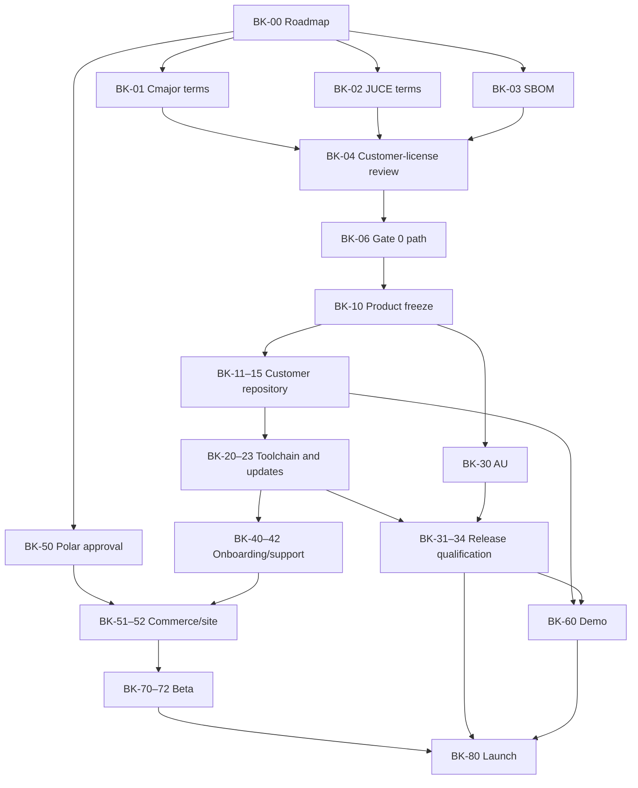

# Enhancer Lite Builder Kit — Product, GTM, and Release Roadmap

Status: **private Builder Kit feed v0.1.0 published; v0.1.1 repair-to-green and clean-customer proof remain open; customer launch gates unresolved**

Last updated: 2026-09-03

Planning origin branch: `codex/enhancer-lite-builder-kit-roadmap-cpm`

Roadmap reconciliation base: `511afc65896aa5b7ec809a46c822ab81b71b5694`

Historical integration baseline at roadmap creation: `origin/master@e3b832ebe8010a40a40e86780bd549467ed744d1`

Dependency-migration authority: `BUILDER_KIT_CPM_DEPENDENCY_MIGRATION.md`. The plain-CPM correction is implemented and qualified on master: one small CMake module uses ordinary CPM calls and its ordinary shared source cache for the exact private Cmajor/CHOC and official JUCE pins. The rejected custom resolver, locks, repair, credential filtering, receipts, and read-only enforcement are gone. Cmajor CLI delivery remains a separate Builder Kit task.

Historical DSP checkpoint: `codex/t26-spectre-wrapper-prototype@2a652a4035519be1fbe12de9a8c6487ed736e3c5`

This document defines the smallest credible macOS launch of the free Cosimo Enhancer Lite plugin and its paid, agent-editable Builder Kit. It is the task and decision authority for that launch plan only. It does not change the fixed two-band T26 Enhancer, the per-voice T62 Enhancer, the T28 Polish chain, or their product contracts.

The roadmap is intentionally gated. The private feed exists, but the customer-facing commercial promise is not yet fully qualified.

## September 3, 2026 execution reconciliation

This is the authoritative current completion ledger wherever the older gate tables, decision notes, or twenty-day schedule below still describe Builder Kit extraction or feed setup as future work. Those later roadmap items remain preserved as product and launch requirements; this checkpoint neither expands them nor marks them complete.

Completed and verified:

- The customer-rights policy remains locked: buyers may use, copy, modify, publish, redistribute, sublicense, and sell Cosimo-authored kit source and derivatives. Cosimo imposes no proprietary restriction on that code. A buyer releasing a closed-source JUCE plug-in must obtain their own JUCE license; the Builder Kit purchase does not include it.
- The private R2 bucket `builder-kit-feed` exists. A live bucket-scoped size check on September 3 returned 78 objects totaling 169,550,604 bytes. The bucket-scoped credential does not grant account-wide bucket listing, so `rclone lsd r2:` returning `AccessDenied` is not evidence that this bucket is absent.
- The private lineage repository `androidStern-personal/builder-kit-releases` exists. Its remote `master` and peeled `v0.1.0` tag both resolve to lineage commit `9eaa543531bb1e2acebd5ff393f363943481a2ef`.
- Builder Kit `v0.1.0` publication is complete. Release-time proof recorded source `cc4eea779248d01f9a28fcce2a0e7c67b887b752`, the `kit.git`, `cmajor.git`, and `choc.git` mirrors, a live HTTP-200 manifest, matching archive hashes, 117 exported files, and the 78 R2 objects above. Its root `LICENSE` and `THIRD_PARTY_NOTICES.md` encode the locked broad Cosimo rights and the buyer-held JUCE requirement.

Still open:

- `v0.1.1` is unpublished; the private lineage remote has no `v0.1.1` tag at this checkpoint.
- Repair-to-green is open. The current extraction branch head is `32aa72c7d76fe1dbefc518cff5a903607f93c697`; its latest Builder Kit workflow, GitHub Actions run `33576976122`, is red on a stale dependency-helper assertion, and the workflow still tolerates a 27-diagnostic TypeScript baseline. The failed run did not reach export proof.
- Clean-customer proof is open. `v0.1.0` feed publication does not prove setup, build, install, update, recovery, AU/Logic, supported-host, signing/notarization, or clean-machine success for a real customer, and it is not public-launch authorization.

Portless is approved only as optional infrastructure on Andrew's personal machine. It is not a repository dependency, product dependency, customer prerequisite, or release gate. It was not on `PATH`, installed, or proven at this checkpoint; installation and validation remain separate work.

Bookkeeping exception: `TODOS.txt` is intentionally untouched because its authoritative primary-checkout copy contains user-owned changes. This roadmap and branch-local `PROGRESS.txt` are the durable record for this reconciliation. No master mutation, push, merge, deployment, publication, installation, or external contact is authorized by this checkpoint.

## 1. Executive decision

### Product

Public base name: **TBD — Andrew rejected “Enhancer” on August 28, 2026**

Locked naming structure:

- Free plugin: **[Base Name]**
- Paid product: **[Base Name] Builder Kit**

Internal working label until the rename is complete: **Enhancer Lite Builder Kit**. This label may remain in code paths and planning files temporarily, but it must not be treated as approved customer-facing branding.

Descriptor: *The finished plugin, plus all the building blocks to make it your own.*

The public funnel has two products:

1. **[Base Name]:** a genuinely useful, finished macOS audio effect.
2. **[Base Name] Builder Kit:** a clean, editable plugin project that a musician can hand to a coding agent, build locally, modify, test, and install.

The founding offer is **$29 for the first 50 buyers**, including lifetime access to upstream kit releases. A later **$49** price is only a hypothesis and requires activation, support, and customer-example evidence.

### Target buyer

A Mac-based musician or producer who already uses, or is willing to use, a filesystem-capable coding agent; has imagined changing a plugin; and has not successfully built one before. The initial buyer wants creative ownership without first learning C++, CMake, signing, and DAW packaging.

### Observable promise

A buyer can copy the purchase-specific setup prompt to a filesystem-capable coding agent, get the baseline plugin retrieved, built, and installed, request one bounded DSP/UI modification, rebuild it under a collision-safe identity, and use the result in a supported DAW.

### Gate 0: commercial-rights policy

**Resolved product decision, September 1, 2026:** buyers may use, copy, modify, publish, redistribute, sublicense, and sell the Builder Kit source and anything they create from it. Cosimo imposes no proprietary restriction on Cosimo-authored customer-kit code. Buyers remain responsible for every third-party component's terms; in particular, anyone creating a closed-source plug-in with JUCE must obtain their own JUCE license. The final customer project and binaries must not embed Cmajor's JIT engine. Do not reopen this product decision unless new written third-party terms directly contradict it.

Current evidence:

- Andrew reports that the Cmajor team replied in writing through Discord that the proposed model is clear without a Cmajor license unless the JIT engine is embedded. The Discord reply remains retrievable and Andrew does not require a duplicate copy in this repository. The Builder Kit therefore takes the no-JIT path; prove from the final customer files and binaries that the JIT engine is absent. Embedding it would reopen licensing. [Cmajor licensing](https://cmajor.dev/docs/Licence) · [Cmajor repository license](https://github.com/cmajor-lang/cmajor/blob/main/LICENSE.md)
- JUCE Support replied in writing on August 31, 2026. Tom at `info@juce.com` wrote: “If your users are creating closed source plug-ins using JUCE then each user will need a JUCE license.” He also confirmed: “You can distribute JUCE as a component of your plug-in kit,” provided users are told about the licensing requirements and directed to the JUCE EULA. Evidence is the Gmail thread `Quick question about licensing an editable plug-in kit`, reply message ID `1a059b7fa9c000d2`. This permits JUCE to be included in the kit but does not transfer or include a customer license. [JUCE licensing](https://juce.com/get-juce/) · [JUCE 9 EULA](https://juce.com/legal/juce-9-licence/)
- The current repository has no root customer license. That is now an implementation gap: add a permissive license file that expresses Andrew's locked broad-rights decision for Cosimo-authored customer-kit code while preserving required third-party licenses and notices.
- Read-only audit task `01a047d0-d360-7481-9cf1-a9f987066c17`, run from the exact clean checkpoint `d005c4e8f88f153bc1904170d99a0aeee41d4ba0`, confirmed that the proposed customer boundary does not itself solve these rights questions.
- Andrew's product decision is that Spectre is not a licensor or permission dependency: no Spectre source was read or copied. Spectre captures, audio, and measurement materials remain internal because they are development references, not customer-product ingredients. This is no longer a launch-rights gate. Andrew rejected the “Enhancer” name, so the current wordmark is excluded; whatever replaces it must have documented ownership.

The Cmajor question is substantively answered for a no-JIT customer build, and the JUCE inquiry is answered for the core source-kit model. Cosimo may distribute JUCE as a kit component, but each customer creating closed-source plug-ins with JUCE must obtain their own JUCE license. The $29 Builder Kit purchase therefore cannot be advertised as including JUCE rights. Customer-facing price, prerequisites, setup, and publishing instructions must disclose this requirement and point to the current JUCE EULA. The reply did not identify a required JUCE tier or price; do not invent one in the roadmap or sales copy.

The paid promise is therefore settled: the kit may be redistributed or sold, derivatives may be closed-source or commercial when the buyer satisfies JUCE and all other third-party terms, and the $29 purchase does not include a JUCE license. The remaining work is to encode this decision in the shipped license/notices and prove the no-JIT release boundary; it is not another founder decision.

## 2. Locked decisions, recommendations, and unresolved gates

| Topic | Status | Decision or recommendation | Consequence |
|---|---|---|---|
| Name | Structure locked; base name open | Free plugin is **[Base Name]**; paid product is **[Base Name] Builder Kit**. Andrew rejected “Enhancer.” | Use a generic description in tester messages. Do not create replacement branding or public copy until the base name is selected and checked. Existing code/file names remain internal working labels until a later authorized migration. |
| Descriptor | Locked | “The finished plugin, plus all the building blocks to make it your own.” | Avoid generic “AI plugin generator” positioning. |
| Headline | Provisional | “Your first plugin is already built.” | Test against the hero demonstration before GA. |
| Free product | Locked | Full Enhancer Lite binary; not intentionally crippled. | The paid product sells ownership and workflow, not missing sound features. |
| Paid product | Locked | Sanitized editable project, setup/update prompts, build system, onboarding, Wavefold example, and lifetime upstream releases. | Never ship the Cosimo monorepo or its full history. |
| Build dependencies | Implemented and qualified | Every supported build uses `cmake/CosimoDependencies.cmake`, ordinary CPM, private Cmajor `f1c9a9a8`, recursive private CHOC `037e34a2`, and official JUCE `501c0767`. | Integrated as `0c38ad96` and qualified at master `e3b832eb`. No custom resolver, cache policy, post-download patch, alternate source, or manual worktree dependency setup is allowed. Cmajor CLI delivery remains separate. |
| Customer source rights | Locked | Buyers may use, copy, modify, publish, redistribute, sublicense, and sell the kit source and derivatives. Cosimo adds no proprietary restriction to Cosimo-authored customer-kit code. | Encode this in the shipped permissive license. Third-party terms still apply; closed-source JUCE plug-ins require the buyer's own JUCE license. Do not reopen the decision. |
| JUCE customer licensing | Written vendor answer received | Cosimo may distribute JUCE as a component of the Builder Kit. Every customer creating closed-source plug-ins with JUCE needs their own JUCE license. | The Builder Kit price does not include a JUCE license. State this before purchase and during setup; link the current EULA and stop rather than guessing about a customer's eligibility, tier, or price. |
| Founding price | Locked for validation | $29, first 50 buyers. | Maximum gross revenue is $1,450; this is a validation cohort, not a profit proof. |
| Later price | Hypothesis | $49 after evidence. | No automatic increase after customer 50; require the Gate 6 metrics. |
| Platforms | Locked | Apple Silicon Macs only, M1 or newer, running macOS 15 Sequoia or macOS 26 Tahoe. | Ship arm64 only. No Intel/Rosetta, macOS 14 or older, Windows, or Linux support in v1. |
| Formats | Locked target | VST3 and macOS AU component. | AU/Logic claims remain blocked until a real AU passes Gate 3. |
| Official hosts | Locked target | Ableton Live 11.3.43 and Live 12.4.5 for VST3; Logic Pro 12.3.1 for AU. | These are the current releases selected for qualification. Public compatibility copy waits until each is proven on the supported macOS releases. Other hosts are best effort. If AU misses the gate, launch scope must be explicitly reduced before publication. |
| Host automation | Locked for v1 | Every user-editable Enhancer Lite sound control is exposed to DAW automation in VST3 and AU, with stable host IDs/order and saved-state parity. | The current endpoints are non-automatable, so implementation requires an explicit host-parameter migration and Ableton/Logic record/playback validation. |
| Standalone Lite behavior | Locked | Preserve current master composition: Low/Bell/High, Stereo/M/S, independent Mid/Side amounts, Tube/Solid, Subtle/Medium, aligned analyzer, direct graph/readout gestures, no de-emphasis circuit. | This is separate from T26 and T62. |
| MIDI tracking | Excluded from Builder Kit v1 | No MIDI/key tracking. | T61's MIDI scope remains intact in its separate product task; this roadmap does not narrow it. |
| iOS AUv3 | Excluded from Builder Kit v1 | No iPhone/iPad product. | T61's iOS AUv3 scope remains intact in its separate product task; this roadmap does not narrow it. |
| Example modification | Locked | Add Wavefold and a distinct solid-color visual identity; invite buyers to ask their agent for another algorithm. | Ship a reproducible completed reference branch plus the starting prompt. |
| Free download | Locked | Email-gated lead magnet with a separate, unchecked marketing opt-in. | The delivery email goes to Polar. Only an affirmative opt-in goes to Resend; declining marketing does not block the download. Show HN is not a launch priority because it favors barrier-free trials. Final consent copy still requires legal review. |
| Checkout | Locked for v1 | Polar merchant-of-record; supersedes Lemon Squeezy. | Agent-operable production/sandbox MCP plus scoped API; use free and one-time products, hosted checkout, license/file benefits, and Customer Portal recovery. Polar owns transactional commerce email. |
| Marketing email | Locked for v1 | Resend free plan; enrollment requires a separate unchecked opt-in. | Resend owns explicitly consented nurture, broadcasts, and automated sequences. The required delivery email alone never enrolls a contact. Stay on the free plan until Andrew separately authorizes spending. |
| Plugin activation | Locked | None. A purchase-specific credential gates setup and future source updates outside the plugin. | The free, paid, and modified plugins never receive a license key, add DRM, or call home; all builds work offline. |
| Source delivery | Locked | The post-purchase page offers only **Download the finished plugin** and **Copy the agent setup prompt**. | The prompt retrieves and initializes the verified Git project through an authenticated signed Git-bundle feed. No manual source-kit download, GitHub account, or repository invitation is part of the customer flow. |
| Updates | Locked definition | One purchase grants permanent access to every future Enhancer Lite source-project update through the private feed, not lifetime bespoke merge support. | “Update my kit” checkpoints local work, retrieves the newest signed bundle, rebases the customer's changes, tests, and installs only on success. Conflicts may require customer action. |
| Internal vendor automation | Locked operational requirement | Andrew's authorized agent must be able to operate selected vendors through official MCP, API, or CLI surfaces. | Internal only: this creates no customer-facing agent endorsement, compatibility promise, or vendor feature. Human account, credential, spending, and publication gates remain. |
| Launch domain and support address | Confirmed | Use `song-machines.com` for the launch and `andrew@song-machines.com` for support. | Andrew reports that the mailbox already receives and sends successfully. Public records checked August 28, 2026 show Name.com as registrar, Vercel nameservers and website hosting, and Forward Email mail routing. |
| Support | Locked | Self-service documentation plus email help for purchase, download, and genuine setup problems. | No custom plugin development, unlimited one-to-one help, or bespoke update/merge support. No Discord commitment at launch. |
| Acquisition | Locked | Free plugin coverage → email/download → modification demo → Builder Kit purchase. | No paid ads before organic conversion evidence. |
| Founder visibility | Locked direction | Andrew appears in or narrates the real modification demonstration; the exact presentation is deferred. | The video must show the real workflow and not a fictional one-click build. |
| Telemetry | Excluded from v1 plugin | No hidden plugin or source-kit telemetry. | Use Polar order/benefit events, explicit surveys, and personal beta follow-up for activation evidence. |

## 3. Scope and non-goals

### Minimum valuable slice

The minimum valuable slice is a finished macOS Enhancer Lite effect plus a clean editable project that lets a minimally technical musician use a filesystem-capable coding agent to install the baseline, make one bounded DSP/UI change, recover from failure, and keep receiving upstream release bundles without destroying local changes.

### Explicitly excluded from v1

- Windows, Linux, VST2, AAX, CLAP, and iOS AUv3.
- Intel Macs, Rosetta support, and macOS releases other than macOS 15 Sequoia or macOS 26 Tahoe.
- MIDI or per-note pitch tracking.
- The fixed two-band T26 Enhancer, T28 Polish chain, and per-voice T62 implementation.
- A hosted prompt-to-plugin generator.
- A plugin marketplace, public remix registry, or agentic in-DAW runtime.
- A large algorithm catalog.
- Guaranteed compatibility with every coding agent, DAW, Xcode version, or future upstream framework release.
- Paid ads, affiliate administration, or a large Discord operation before conversion evidence.
- Runtime license activation, background telemetry, or a custom account system.
- Shipping the complete Cosimo repository, private history, Spectre corpus, user audio, unreleased synth code, internal plans, or unrelated dependencies.
- Guaranteed automatic resolution of update conflicts.
- Cosimo signing or notarizing arbitrary customer-authored derivatives.

## 4. Release product contract

### 4.1 Free Cosimo Enhancer Lite

Release contents:

- Email-gated access to the installer; the email requirement is a delivery/acquisition step, not plugin activation or DRM.
- Apple Silicon arm64 macOS VST3 for M1-or-newer Macs on macOS 15 Sequoia and macOS 26 Tahoe.
- Apple Silicon arm64 macOS AU component after it passes Gate 3 on both supported macOS releases.
- Signed and notarized installer package.
- Checksums, release manifest, versioned release notes, third-party notices, install instructions, and uninstall instructions.
- No source project and no license activation.

Required retained behavior from current master:

- One frequency-selective shape: Low, Bell, or High.
- Stereo or Mid/Side routing.
- Independent Mid and Side Amounts in M/S mode.
- Frequency, Q, Tube/Solid Character, and Subtle/Medium Intensity.
- Four-times short polyphase-IIR oversampling and truthful three-sample latency.
- No de-emphasis path.
- Direct graph editing and draggable Frequency, Amount/Mid, Side, and Q readouts.
- Logarithmic Frequency and Q gesture laws.
- DAW automation for every user-editable sound control, with stable parameter identity across VST3/AU and release updates.
- Before/after analyzer aligned to the response graph.
- Solid-black neon base interface. The current Enhancer Lite wordmark is excluded; create replacement branding only after the new public name is selected and its ownership is documented.
- Saved state, control smoothing, finite output, mono/stereo coherence, zero-effect dry behavior, and the accepted shelf/audio corpus.

Public release claims must be regenerated from the final release commit. Historical pluginval, Ableton, Spectre, measurement, and checksum evidence cannot substitute for final artifact provenance.

### 4.2 Paid Builder Kit

The paid entitlement includes:

- The same finished VST3/AU installer as the free product.
- Access through the copied setup prompt to `enhancer-lite-builder-kit-<version>.bundle`: a signed, sanitized Git bundle with release tags and no private Cosimo history. The customer does not manually download the source bundle.
- `START-HERE.md`: the single copied setup prompt and a plain-language fallback path.
- `README.md`, `AGENTS.md`, `BUILDING.md`, `MODIFYING.md`, `UPDATING.md`, `PUBLISHING.md`, `TROUBLESHOOTING.md`, and `SUPPORT.md`.
- `onboarding/index.html`: a local, branded welcome page opened after a successful setup.
- Deterministic `doctor`, `setup`, `test`, `build`, `install`, `configure`, `update`, and `recover` commands.
- A completed `examples/wavefold` reference branch/tag, its prompt, focused tests, and before/after audio.
- Customer-facing focused tests that do not require proprietary reference corpora or the Cosimo monorepo.
- Product license, third-party notices, dependency lock, and actual-build software bill of materials.

The kit license must state Andrew's locked broad-rights decision plainly:

- The buyer may use, copy, modify, publish, redistribute, sublicense, and sell the kit source and derivatives.
- Cosimo imposes no proprietary restriction on Cosimo-authored customer-kit code.
- Which dependencies require the buyer's own license.
- What branding and identifiers must be replaced.
- What “lifetime updates” includes and excludes.
- That coding-agent subscriptions, Apple Developer membership, signing identities, and third-party fees are not included.

The written JUCE requirement is now concrete: any buyer creating closed-source plug-ins using JUCE needs their own JUCE license. A Builder Kit purchase does not supply that license. The free compiled plugin does not make its downloader a Builder Kit developer; this customer-license requirement belongs to the editable paid workflow.

### 4.3 Customer project identity

One checked-in `product.json` is the source of truth for:

- Product and manufacturer names.
- Bundle identifier.
- four-character plugin and manufacturer codes.
- Semantic version.
- Output filenames and install paths.
- Wordmark/logo paths and UI accent/background tokens.
- Copyright and support URLs.

`npm run configure` must:

1. Preserve the pristine upstream release tag.
2. Ask for or accept the new product/manufacturer identity.
3. Generate valid collision-resistant identifiers and validate four-character codes.
4. Replace Cosimo marks in customer-facing binaries and resources when publishing mode is selected.
5. Create a recovery commit before changing generated files.
6. Refuse an identity that collides with the original or an already installed kit project.

Personal local experimentation may retain the Cosimo identity, but a distributable derivative may not.

### 4.4 Build and signing modes

The project distinguishes two modes:

Before either editable-project mode uses JUCE to create a closed-source plug-in, the customer must be clearly told that they need their own JUCE license and pointed to the current JUCE EULA. Cosimo does not select a tier, quote a price, or represent that the $29 kit purchase satisfies JUCE's EULA.

- **Local mode:** deterministic arm64 build, ad-hoc signing, user-level installation, and supported-host smoke on the customer's M1-or-newer Mac running macOS 15 or 26. This is the core activation path.
- **Distribution mode:** customer-specific identity, Developer ID Application/Installer signing, hardened-runtime review, notarization, stapling, distributable installer, and clean-machine verification. The broad commercial right is locked; this mode still requires the customer's own Apple Developer credentials, required JUCE license, and the release's no-JIT proof.

Cosimo's Apple certificates, Polar organization tokens/MCP credentials, notary credentials, and signing secrets never enter the customer repository, release archive, logs, prompts, or support bundles.

Apple requires Developer ID signing and notarization for trustworthy distribution of downloaded macOS plug-ins and installer packages. [Apple notarization](https://developer.apple.com/documentation/security/notarizing-macos-software-before-distribution) · [Apple packaging](https://developer.apple.com/documentation/xcode/packaging-mac-software-for-distribution)

## 5. Customer journeys

### 5.1 Free plugin

1. Visitor reaches the landing page through a review, product database, video, press item, or referral.
2. Visitor chooses the free Enhancer Lite download and sees the exact macOS/DAW requirements.
3. Polar's free-product checkout collects the required delivery email. A separate marketing checkbox is unchecked by default; only an affirmative opt-in is handed to Resend, and declining it does not block delivery. Final copy remains subject to legal review.
4. Visitor receives the current signed/notarized installer and checksum.
5. Installer places VST3 and AU in standard user locations.
6. The user rescans/restarts the host if required and loads the plugin.
7. The success page and plugin About panel present a restrained “Make it yours” link.

Failure behavior:

- Unsupported OS/architecture is shown before download.
- Lost download access is recoverable through Polar's email-authenticated Customer Portal.
- A failed installer provides a diagnostic log and manual uninstall path.
- A missing host scan is documented without claiming the install failed.

### 5.2 Paid setup

1. Buyer purchases the founding Builder Kit.
2. The purchase-success page presents exactly two customer actions: **Download the finished plugin** and **Copy the agent setup prompt**. There is no manual source-setup path.
3. Polar records the purchase and exposes the finished download, receipt, and purchase-specific setup/update credential for recovery. The credential never activates the plugin.
4. The copied prompt contains the purchase-specific setup command. The agent authenticates to the private feed, retrieves and verifies the signed Git bundle, clones it locally, and creates the customer customization branch from the immutable release tag. Downloading the source and creating the repository are one invisible user-facing step.
5. `doctor` inventories the machine without changing it and explains missing requirements in plain language.
6. Before the editable project first uses JUCE, `setup` presents the written per-customer licensing requirement and links the current JUCE EULA. With permission, it then installs or guides only the documented external build tools. Cmajor, CHOC, and JUCE are fetched lazily by ordinary CPM during the first configure/build and then reused from CPM's normal user cache.
7. `test`, `build`, and `install` produce and install the baseline local-mode plugin.
8. The agent confirms the installed path and asks the user to perform the supported-host smoke.
9. Onboarding HTML opens and explains modification, recovery, updates, publishing limits, and support.

The agent must stop—not improvise—when licensing terms are unaccepted, required Apple/Xcode agreements need human interaction, a checksum fails, or an unsupported environment is detected.

### 5.3 First modification

1. Agent creates a named recovery checkpoint and modification branch.
2. User describes one algorithm and optional visual identity change.
3. Agent identifies affected DSP, state, UI, and test seams before editing.
4. Agent writes or updates focused tests, implements the change, and runs finite-output, dry, state, UI, and audio checks.
5. Agent builds and installs only after tests pass.
6. User auditions the result in a supported host and either keeps it or asks the agent to recover.

The launch example adds Wavefold plus a distinct solid-color treatment. Marketing must show an edited 90-second hero cut **and** an honestly timed longer workflow; it must not imply that arbitrary changes always finish in 90 seconds.

### 5.4 Update while preserving customer changes

1. Customer asks the agent to “Update my kit”; the customer does not manually download or import source.
2. The update workflow reads the purchase-specific credential from ignored local project configuration, or asks the customer to recover it from the Polar order if missing. It never prints or commits the credential.
3. The agent authenticates to the private update feed, retrieves the newest entitled signed Git bundle, and verifies its signature/checksum and the local repository state.
4. Agent commits or archives every local change and creates a recovery branch/tag.
5. Agent fetches the new immutable upstream release tag from the bundle.
6. Agent rebases the customer customization branch onto the new tag.
7. On conflict, the operation stops with the original branch and working build intact; no plugin is installed.
8. After a clean or deliberately resolved rebase, the complete customer test gate runs.
9. Only a green build is installed. The prior installed version remains recoverable.

Lifetime updates mean access to these upstream bundles. They do not guarantee conflict-free rebases or bespoke repair of every customer modification.

### 5.5 Publish a derivative

This flow remains unpublished until the permissive license/notices and no-JIT release proof exist.

When enabled:

1. Customer accepts the applicable Cosimo and third-party terms.
2. `configure` proves non-Cosimo identity and unique plugin codes.
3. `doctor --distribution` verifies the customer's own Apple membership, identities, and notarization configuration without exposing secrets.
4. Release tests and license/notice generation pass.
5. Customer's machine signs, packages, notarizes, staples, and verifies the derivative.
6. A clean account or clean Mac validates Gatekeeper, VST3, AU, state recall, and uninstall.

Cosimo does not sign, notarize, host, endorse, or assume responsibility for arbitrary customer DSP in v1.

## 6. Technical boundary and repository architecture

### 6.1 Canonical sources

- Future release engineering starts from current master after the coordinator's composed shelf/readout commits, not from historical `2a652a40`.
- The Builder Kit release repository is generated from an explicit allowlist and reviewed as its own product.
- The export fails if a file is unclassified, a forbidden path enters the bundle, a license is missing, or a generated file lacks provenance.

Forbidden customer content includes internal TODO/progress files, other Cosimo products, Spectre captures and ignored corpora, private research notes, user audio, unrelated build tools, installed artifacts, secrets, caches, and complete monorepo history.

### 6.2 Proposed customer repository

```text
enhancer-lite-builder-kit/
  AGENTS.md
  README.md
  LICENSE.md
  THIRD_PARTY_NOTICES.md
  product.json
  toolchain.lock.json
  cmake/
    CPM.cmake
    CosimoDependencies.cmake
  package.json
  package-lock.json
  dsp/
  plugin/
  ui/
  assets/
  tests/
    dsp/
    state/
    ui/
    audio/
    fixtures/
  scripts/
    doctor.*
    setup.*
    configure.*
    build.*
    test.*
    install.*
    package.*
    update.*
    recover.*
  docs/
    BUILDING.md
    MODIFYING.md
    UPDATING.md
    PUBLISHING.md
    TROUBLESHOOTING.md
    SUPPORT.md
  onboarding/
    index.html
    assets/
  examples/
    wavefold/
  sbom/
```

### 6.3 Toolchain contract

Source dependencies and external tools have separate, non-overlapping authorities:

- `cmake/CosimoDependencies.cmake` alone pins the Cmajor repository/commit, recursive CHOC commit, and JUCE repository/commit and retrieves them through ordinary CPM.
- `toolchain.lock.json` records only prerequisites outside CPM. It must not repeat or override the Cmajor, CHOC, or JUCE URLs or commits.

The external-tool file covers at minimum:

- Stable Xcode and Command Line Tools range.
- macOS 15.0 deployment target plus explicit macOS 15 Sequoia and macOS 26 Tahoe qualification targets.
- Node and npm.
- CMake.
- Cmajor CLI version and acquisition path, which remains unresolved.
- Any non-CPM SDK or wrapper prerequisite discovered from the final customer build.

T69 completed the repository source-dependency portion on master `e3b832eb`: production callers use private Cmajor `f1c9a9a8`, recursive private CHOC `037e34a2`, and official JUCE `501c0767` through plain CPM. The remaining customer reproducibility gap is the `cmaj` command-line program and the exact external Xcode/Node/CMake range—not Cmajor/CHOC/JUCE source retrieval.

### 6.4 Command contract

| Command | Required behavior |
|---|---|
| `doctor` | Read-only inventory; requires Apple Silicon M1 or newer and macOS 15 or 26; identifies disk, Xcode agreement, Node/npm, CMake, Cmajor, JUCE, agent, DAW paths, signing mode, and unsupported conditions. Emits a redacted support report and rejects Intel/Rosetta or other macOS releases before mutation. |
| `setup` | Installs or guides missing external tools after consent and is safe to rerun. It does not create another dependency downloader; ordinary configure/build lets CPM lazily fetch and cache Cmajor, CHOC, and JUCE. |
| `test` | Runs customer-contained DSP, finite-output, dry, state, UI, audio, and build-contract tests. No proprietary corpus or network required after setup. |
| `build` | Produces deterministic arm64 local-mode VST3/AU artifacts from a clean tree. |
| `install` | Backs up/replaces only the exact target plugin bundles, signs locally, verifies, and prints rescan/restart instructions. |
| `configure` | Creates customer identity from `product.json`, validates collisions, removes publishing-forbidden Cosimo marks, and checkpoints first. |
| `package` | Builds a customer-signed distribution artifact when the customer supplies the required JUCE and Apple credentials and the no-JIT release checks pass. |
| `update` | Imports an authenticated upstream Git bundle, checkpoints, rebases, tests, and installs only on success. |
| `recover` | Restores a named code/install checkpoint without deleting unrelated customer work. |

All mutating commands support `--dry-run`, state their exact targets, refuse broad paths, and avoid storing secrets.

### 6.5 Test separation

Two test layers are required:

1. **Internal qualification:** retains Spectre comparison, complete accepted audio corpora, benchmark evidence, pluginval, host validation, and private release checks inside Cosimo.
2. **Customer gate:** self-contained tests of the shipped DSP/UI/state/build contract and safe modification behavior.

The current shelf-corpus test points at the ignored `build/t26-spectre-shelves` measurement corpus, and `ui/shared/enhancer-lite-state.ts` imports shared mode/curve vocabulary from the two-band state module. Both dependencies must be audited and severed before customer export. Customer tests may use newly authored redistributable fixtures and summarized numeric tolerances, never private reference audio.

### 6.6 Read-only release-boundary and SBOM checkpoint

Evidence status: **completed read-only proposed-boundary audit at exact roadmap checkpoint `d005c4e8f88f153bc1904170d99a0aeee41d4ba0`; not an actual-build SBOM and not release approval.** Audit task `01a047d0-d360-7481-9cf1-a9f987066c17` used a clean worktree, created no build directory or artifact, and made no build, install, package, account, publication, merge, push, or deployment changes.

Audit verdict: **HOLD for implementation proof, not for another customer-rights decision.** BK-03 now has an evidence-backed proposed customer boundary, the Cmajor/JUCE vendor questions are answered, and Andrew has locked broad customer rights. The audit remains open until the permissive license/notices are added, the no-JIT boundary is proven, and replacement-brand ownership is documented. Andrew is still reviewing the Builder Kit extraction architecture, so the actual customer repository and leak tests must not start yet. T69 closed the repository's Cmajor/CHOC/JUCE source-pin and moving-download gap; BK-20 remains open for the customer-facing `cmaj` and external-toolchain contract. BK-32 must still regenerate the final inventory from the exact build that would ship.

Observed workstation versions are macOS 26.5.1 on arm64, Xcode 26.5, Node 22.16.0, npm 11.4.1, CMake 4.2.3, and `cmaj` 1.0.3066. They describe the inspected machine, not the eventual supported range or locked customer toolchain.

| Component | Observed evidence | Release disposition / open proof |
|---|---|---|
| Cosimo Enhancer Lite source | Relevant source first appears in Andrew-authored Git commits, including `71f106b9`, `887757f3`, and `47dadd75`; the repository has no root customer license. | Andrew has locked broad permissive customer rights. Add the matching license file to the extracted customer project; this is implementation, not an open product choice. |
| Cmajor | Plain CPM pins private `androidStern-personal/cmajor` at `f1c9a9a8e85dcc82141326a2fc1c5160241f346c`. Andrew reports written Cmajor clearance in Discord unless the JIT engine is embedded. | The reply remains retrievable in Discord; no duplicate evidence copy is required. Prove the final customer project and binaries use the no-JIT path. Any embedded JIT engine requires separate licensing. |
| CHOC | Cmajor recursively pins private `androidStern-personal/choc` at `037e34a2b382175c8bee4be5a0707724130f10e8`. The committed fixes are baseline correctness for every production build. | Preserve upstream ISC notices and patch provenance, and define lawful customer access to the exact private source. Do not create a second or reduced dependency stack for Lite. |
| JUCE | Plain CPM pins official JUCE at `501c07674e1ad693085a7e7c398f205c2677f5da`. JUCE Support confirmed in writing on August 31, 2026 that JUCE may be distributed as a component of the kit and that every user creating closed-source JUCE plug-ins needs their own license. | The moving-download and kit-delivery questions are closed. Customer disclosure/confirmation, the exact VST3/AU wrapper inventory, notices, and final-binary inclusion remain BK-21/BK-32 work. Do not claim the kit price includes a JUCE license or invent the customer's required tier. |
| VST3 SDK and wrapper dependencies | Enter transitively through the generated JUCE project; no exact release inventory is locked in the current Lite path. | Record exact versions, licenses, notices, and binary inclusion from the final pinned build. |
| Apple SDK, WebKit, and Audio Unit APIs | Supplied by Xcode/macOS rather than copied from this repository. | Lock the supported Xcode/deployment range and document customer prerequisites; actual distribution still needs signing/notarization proof. |
| JavaScript build/test tooling | The root lock contains 316 dependency entries plus the root project and includes unrelated product/media dependencies. Lite UI is vanilla TypeScript, while the shared build script also loads React tooling. | Create a dedicated minimal package and lock after authorization. Vite/esbuild and Playwright are build/test-only candidates; recompute licenses from the exact customer closure. |
| Spectre-derived research evidence | Committed findings describe black-box measurements and state that no Spectre source was read or copied and no Spectre audio is retained in the implementation runner. Lite DSP comments preserve measured transfer targets and cite public RBJ/JUCE filter methods. | Andrew has decided this creates no Spectre permission obligation. Keep Spectre captures, audio, corpora, fixtures, and measurement tools internal as development references; do not claim source-code identity or affiliation. |
| Current Enhancer Lite wordmark PNG | First appears in `71f106b9`; the PNG contains no embedded authorship/license metadata and no source artwork or origin declaration was found. Andrew subsequently rejected the “Enhancer” name. | Exclude it from the release. Its provenance no longer blocks launch unless Andrew later chooses to reuse it. Any replacement branding must have documented ownership. |

The proposed export is an **allowlist design, not a shippable archive**:

| Disposition | Current source | Required release treatment |
|---|---|---|
| Candidate include | `cmajor/EnhancerLite.cmajor`; `cmajor/EnhancerLiteSpectrumAnalyzer.cmajor`; `fx/enhancer_lite/EnhancerLitePlugin.cmajor`; `fx/enhancer_lite/EnhancerLite.cmajorpatch`; `fx/enhancer_lite/view/{source.ts,gesture-policy.ts,spectrum.ts}` | Copy into product-local `dsp/`, `plugin/`, and `ui/` paths only after the Builder Kit extraction architecture and Cosimo customer license are approved. |
| Include after isolation | `ui/shared/enhancer-lite-state.ts` | Remove its import of the full T26 `ui/shared/enhancer-state.ts`; make Lite vocabulary product-local or depend on a tiny explicitly approved module. |
| Excluded working-name asset | `fx/enhancer_lite/assets/enhancer-lite-wordmark.png` | Do not include it in the release or use it as the basis for replacement branding. |
| Candidate customer tests | `tests/cmajor_enhancer_lite/*.cmajor` | Repath into the product repository and verify every fixture is redistributable. |
| Rewrite/split | `tests/test_enhancer_lite_state.mjs`; `tests/test_enhancer_lite_view_browser.mjs` | Remove WavetableSynth, EffectsRack, monorepo helper, and shared-build assumptions; retain only standalone Lite behavior. |
| Author product-only | Manifest/identity, independent Lite state, production loader, build/setup/update/recovery tooling, documentation, minimal `package.json` and lock, customer-contained tests, and SBOM/notices | These customer files do not exist as an isolated product today. Rewrite them against the clean boundary; do not copy monorepo-wide helpers or dependency manifests. |
| Fetch under the approved terms | Exact Cmajor, CHOC, JUCE, VST3 SDK, generated wrapper, and other transitive framework components | JUCE may be distributed as a kit component, but closed-source customers need their own license and must see the requirement/EULA before purchase and during setup. Use the same plain-CPM pins, prove the no-JIT Cmajor path, resolve the remaining components' terms, and generate notices and the actual-build SBOM. |
| Internal only | `fx/enhancer_lite/EnhancerLiteShelvesAudition.cmajorpatch`; `scripts/measure_enhancer_lite*.mjs`; Spectre fixtures/corpora/audio and measurement scripts; full T26 state/DSP; T28/T61/T62 sources; WavetableSynth/EffectsRack; TODO/PROGRESS/roadmap/ADR files; unrelated fonts/icons/images/audio; caches; installed/generated artifacts; secrets; private paths; monorepo helpers and history | Forbidden by the customer export and negative leak tests. Summarized redistributable tolerances and newly authored fixtures may be created later. |

This boundary preserves six distinct authorities: standalone Enhancer Lite, its Builder Kit launch, T26, T61, T62, and T28. The Builder Kit is a distinct launch workstream and does not revise any of the other product contracts.

### 6.7 AU and Logic technical-feasibility checkpoint

Verdict: **source-level AU feasibility is plausible; a releasable Lite AU is unproven.** The Lite patch is a stereo, non-instrument effect without MIDI, and Cmajor's JUCE generator is documented as supporting AU as well as VST. [Cmajor patch format](https://cmajor.dev/docs/PatchFormat) · [Cmajor getting started](https://cmajor.dev/docs/GettingStarted)

The current production script nevertheless builds only `${cmakeTarget}_VST3`, installs only a `.vst3`, explicitly avoids AU installation, takes `cmaj` from `PATH`, and provides only ad-hoc signing. Cmajor, CHOC, and JUCE source retrieval is now pinned through plain CPM, but no Enhancer Lite `.component`, arm64-architecture inspection, `auval` result, Logic load/state/WebView/latency test, Developer ID signing record, notarization ticket, macOS 15 clean-install result, or cross-format saved-state evidence has been produced.

The audit also confirmed that all eight current sound endpoints—Frequency, Q, Routing, Amount/Mid, Side, Character, Intensity, and Shape—are explicitly non-automatable, and no begin/end host-gesture bracketing was found in the UI. This is verified current behavior, not an open v1 product choice: Andrew already locked DAW automation for every sound control. Future BK-12 work must therefore use a versioned, stable parameter/state migration and add host gesture handling before VST3/AU parity can pass. No implementation of that migration is currently authorized.

Gate 3 therefore remains failed. With the customer-rights policy locked, explicit implementation authorization is the next prerequisite. Then: build the clean allowlist and negative leak tests; isolate state/tests and finish the external `cmaj`/toolchain contract on top of the completed plain-CPM source pins; run a private disposable real-AU spike; and complete Developer ID signing/notarization and clean Logic/Ableton qualification on macOS 15 and 26. Existing Cosimo Synth AU/iOS AUv3 work is not Enhancer Lite AU proof.

## 7. Commerce and entitlement

### 7.1 Provider

Use **Polar** for v1. Andrew selected it on August 28, 2026. Launch remains subject to organization/compliance approval and complete sandbox and live purchase tests. This supersedes the roadmap's older Lemon Squeezy recommendation.

Verified current capabilities:

- Merchant-of-record handling for checkout and sales-tax/VAT collection.
- Free and one-time digital products.
- Hosted Checkout Links, API-created Checkout Sessions, and optional embedded checkout.
- File-download benefits with signed customer URLs, SHA-256 checksums, and files up to 10 GB.
- Generated purchase-specific credentials accessible for recovery; v1 uses the credential only to authorize setup and source-update feed access, never to activate a plugin.
- Email-authenticated Customer Portal access to orders, receipts, purchase credentials, and finished-plugin file benefits.
- Transactional order/customer-portal emails.
- First-party production and sandbox MCP servers, scoped organization access tokens, a documented REST API, SDKs, and webhooks.
- Published Starter pricing beginning at 5% + $0.50 per transaction; final fees and payout terms require account verification.

[Polar MCP](https://polar.sh/docs/integrate/mcp) · [Products](https://polar.sh/docs/features/products) · [Checkout Links](https://polar.sh/docs/features/checkout/links) · [File downloads](https://polar.sh/docs/features/benefits/file-downloads) · [License keys](https://polar.sh/docs/features/benefits/license-keys) · [Customer Portal](https://polar.sh/docs/features/customer-portal/introduction) · [Merchant of Record](https://polar.sh/docs/merchant-of-record/introduction)

Polar's agent-operability is the decisive advantage for Andrew's internal launch operations, but it is not a customer-facing feature or permission for unattended production mutation. BK-51 must prove the exact required MCP/API actions in Polar's sandbox with least-privilege credentials before the roadmap relies on them. Andrew retains account creation, credential authorization, compliance, banking, refunds, and publication gates.

Polar is not the marketing-email system. Its transactional messages deliver purchase/portal access; Resend handles explicitly consented nurture, broadcasts, and automated sequences. Polar also does not preserve customer branches or act as a private Git remote. Polar records entitlement and recovers the purchase credential; the separate authenticated signed Git-bundle feed transports source setup and lifetime updates through the copied agent prompt.

### 7.2 Product catalog

| Product | Price | Entitlement | State at launch |
|---|---:|---|---|
| Free plugin — public name TBD | Free | Current signed/notarized installer and release notices | Active after naming and release gates pass |
| Paid Builder Kit — Founding, public name TBD | $29 one time | Current Builder Kit bundle plus lifetime upstream releases | Active after naming and release gates pass; hard cap 50 |
| Paid Builder Kit — public name TBD | $49 one time | Same entitlement | Disabled until Gate 6 evidence |

### 7.3 Data and consent

- Polar is the source of truth for purchase, refund, finished-download entitlement, and recovery of the setup/update credential.
- Resend may receive contacts only under the final privacy/consent policy and only after the visitor affirmatively selects a separate marketing opt-in that is unchecked by default.
- The email required for Polar's free-product delivery is not itself marketing consent. Declining the Resend opt-in does not block the download. Polar's transactional delivery and Resend's marketing messages remain separate.
- The purchase-specific setup/update credential may be templated into the copied prompt and saved only in ignored local project configuration. It is never printed, committed, pushed, embedded in an archive, or consumed by a plugin.
- Refunds disable future paid-file entitlement where supported, but cannot revoke already downloaded source; the policy must say this honestly.
- KYC/KYB, payout identity, banking, tax treatment, privacy notice, refund policy, and marketing consent require Andrew's human completion and approval.

Recommended founding refund promise, pending counsel and Polar policy review:

> If the documented coding-agent workflow cannot get the unmodified baseline built and installed on a declared supported Mac after the documented diagnostics, request a refund within 14 days.

This does not promise support for arbitrary modifications or commercial publishing.

### 7.4 Marketing email provider

Use **Resend** for v1. Andrew selected it on August 28, 2026. This is a provider decision only; it does not authorize account creation, credential access, production broadcasts, or paid-plan spending.

- Resend owns opted-in contacts, broadcasts, and automated email sequences; Polar remains the system for transactional purchase, download, receipt, and Customer Portal email.
- A Polar-to-Resend handoff must transmit only contacts who affirmatively selected the separate unchecked marketing opt-in, and must preserve consent evidence, unsubscribe state, and suppression state.
- Agents may operate the authorized email surface through Resend's official MCP, API, or CLI with least-privilege credentials. Andrew retains account creation, token authorization, production activation, and campaign-send gates.
- At selection time, Resend's published free plan permits up to 1,000 marketing contacts and 10,000 automation runs per month. The system must not upgrade, incur spend, or silently exceed a free limit; it pauses enrollment/imports and asks Andrew to approve the next action.
- The exact launch sequence, content, timing, and enrollment rules remain open until Andrew's Day 9 approval. That approval must name every email's subject and body, who receives it, when it sends, and what removes a person from the sequence; nothing sends before launch.

[Resend MCP](https://resend.com/mcp) · [Automations](https://resend.com/docs/dashboard/automations/introduction) · [Account limits](https://resend.com/docs/knowledge-base/account-quotas-and-limits) · [Pricing limits](https://resend.com/docs/knowledge-base/what-is-resend-pricing)

## 8. Go-to-market system

### 8.1 Acquisition funnel

```text
Free-plugin discovery
        ↓
Enhancer Lite landing page and honest sound/UI proof
        ↓
Email-gated free download
        ↓
Installed plugin + “Make it yours” invitation
        ↓
Wavefold modification demonstration
        ↓
$29 founding Builder Kit
        ↓
Successful customer modifications and permissioned stories
```

The free plugin is the acquisition product. The Builder Kit is the paid conversion. Do not launch the paid source kit cold.

### 8.2 Discovery channels

Primary launch distribution:

- KVR developer product listing and factual launch-news submission. [KVR submissions](https://www.kvraudio.com/submissions/)
- Editorial pitches to Bedroom Producers Blog, Rekkerd, Audio Plugin Guy, and comparable free-plugin/news outlets.
- Launch-day outreach to 20–30 small, relevant music-production, audio-development, and agent-workflow creators after the controlled beta passes.
- The owned full workflow video, cut into focused short clips.
- A legitimate educational contribution or partnership pitch to The Audio Programmer community, not drive-by link spam. [The Audio Programmer](https://www.theaudioprogrammer.com/)

Secondary only after initial proof:

- Search-oriented articles and videos such as “Build your first VST with a coding agent” and “Modify a real audio plugin without learning C++ first.”
- Customer modification features.
- Product Hunt for the source/agent story.

Defer Show HN while the free download is email-gated. Defer affiliates and paid ads until organic funnel conversion is measured.

### 8.3 Launch assets

- 90-second edited hero transformation: stock plugin → Wavefold request → visible DSP/UI change → rebuilt plugin in Ableton.
- An uncut or honestly timed longer walkthrough showing setup, tests, build, install, and audition.
- Before/after audio on representative drums, bass, synth, and full mix material with loudness-matched presentation.
- Product screenshots in Bell/Stereo, Bell/M/S, Low, High, and Wavefold-example states.
- Press kit: factual description, formats, system requirements, pricing, availability, screenshots, wordmark, demo links, support link, and direct download/purchase links.
- Landing page, FAQ, license summary, privacy notice, refund terms, and support boundaries.
- Free-delivery email and one Builder Kit follow-up showing the modification story.
- Beta/customer examples only with explicit permission for name, quote, prompt, screenshot, and audio.

All sales pages, checkout text, delivery email, onboarding, and demo narration address the musician or buyer directly. They describe the sound, the result, and the next action in plain English. They must not expose internal architecture, task IDs, repository boundaries, test strategy, implementation caveats, or instructions addressed to a developer. Agent/build instructions live in clearly separate technical files inside the kit and are never pasted into customer marketing copy.

Hero copy must sell the ability to modify a real plugin, not AI magic or reverse-engineering history.

## 9. Metrics and decision rules

### 9.1 Founding beta gate

Ten target users receive the kit without payment and without Andrew silently repairing their machines.

- At least 8/10 build and install the baseline.
- At least 6/10 complete one self-chosen modification.
- Every repeated setup failure is fixed or explicitly declared unsupported.
- At least 3 permissioned quotes/examples exist before public launch; 5 is preferred.
- Median and worst-case support time are recorded.
- Andrew confirms that the observed support time and the named launch coverage are manageable for the capped 50-buyer offer; otherwise the launch is held.

### 9.2 First 60-day targets

These are planning targets, not forecasts:

| Metric | Definition | Target |
|---|---|---:|
| Qualified free acquisition | Completed free checkout with installer available | 1,500 |
| Free download completion | Free checkout → binary downloaded | Record baseline; no invented target before launch |
| Builder conversion | Free downloader → paid purchase within 60 days | 50 founding purchases; approximately 3–4% working hypothesis |
| Baseline activation | Paid buyer reports baseline installed within seven days | At least 30/50 |
| First customization | Paid buyer reports first modification within seven days | At least 30/50 aspirational; investigate if below 15/50 |
| Permissioned proof | Customer permits a quote, screenshot, prompt, or audio example | At least 10 |
| Refunds | Refunded founding orders / founding orders | Under 10% |
| Support economics | Median and worst-case support minutes per buyer | Measure; no $49 launch if routine setup needs bespoke intervention |

Without plugin telemetry, activation comes from a short seven-day survey and personal founding-cohort follow-up. Never infer successful installation from a download event.

### 9.3 Diagnostic interpretation

- Low landing traffic: distribution or content problem.
- Traffic but low free checkout: free-plugin positioning, trust, compatibility, or email-friction problem.
- Free downloads but low paid conversion: Builder Kit promise, demo, price, or licensing limitation problem.
- Purchases but failed baseline setup: packaging/toolchain/onboarding problem.
- Baseline success but few modifications: modification workflow or target-customer problem.
- Successful modifications but no permissioned stories: weak social proof loop or inappropriate sharing request.
- High support time or refunds: do not scale reach or raise price.

## 10. Work breakdown structure

Owner codes:

- **A:** agent-owned implementation/research in an isolated worktree.
- **H:** human-only decision, credential, audition, relationship, or legal act.
- **A/H:** agent prepares and verifies; human approves or performs the irreducible action.

| ID | Work item | Owner | Depends on | Deliverable and completion test | Estimate |
|---|---|---|---|---|---:|
| BK-00 | Lock roadmap | A/H | — | This document committed on its dedicated current-master branch; Andrew approves material product decisions. | 1–2 d |
| BK-01 | Cmajor builder/OEM inquiry | H | BK-00 | **Complete:** Andrew reports written clearance in Discord unless the JIT engine is embedded. The reply remains retrievable there; no duplicate repository copy is required. The release must prove the customer project and binaries contain no JIT engine. | Complete |
| BK-02 | JUCE builder/OEM inquiry | H | BK-00 | **Complete August 31, 2026:** JUCE Support confirmed that Cosimo may distribute JUCE as a component of the kit and that each user creating closed-source JUCE plug-ins needs their own JUCE license. Exact reply and Gmail evidence locator are preserved in this roadmap and the August 31 launch journal. | Complete |
| BK-03 | Dependency and asset SBOM | A | BK-00 | The checkpoint audit supplies the proposed customer-file boundary. Before implementation, every file/library/asset is classified and every missing term is resolved or explicitly blocks release; BK-32 later regenerates the final list from the exact build being shipped. | 2–3 d |
| BK-04 | Encode customer license and notices | A/H | BK-01–03 | **Rights decision complete September 1:** buyers may use, copy, modify, publish, redistribute, sublicense, and sell the kit and derivatives. Add the matching permissive license for Cosimo-authored code, preserve third-party notices, disclose the buyer-held JUCE requirement, and state warranty/support/refund terms. Do not call it counsel-approved. | 0.5–1 d |
| BK-05 | Choose and check the public name | H | BK-00 | Andrew selects replacement names for the free plugin and paid kit; searches then check the exact candidates before branding or public copy proceeds. “Enhancer” is rejected. | External |
| BK-06 | Choose Gate 0 path | H | BK-01–05 | **Complete September 1:** broad permissive customer rights, including redistribution and sale of the kit and derivatives; buyer supplies any required JUCE license; final build uses no Cmajor JIT engine. | Complete |
| BK-07 | Reconcile repo task authority | A/H | BK-00 | Record the Builder Kit as a distinct launch workstream: its v1 excludes iOS/MIDI without narrowing T61 and does not alter standalone Lite, T26, T62, or T28. Reconcile the tracker before implementation. | 0.5 d |
| BK-10 | Freeze release feature contract | A/H | BK-06–07 | Current master composition enumerated and state/ID/version contract frozen; Andrew approves sound, controls, shelves, analyzer, gestures, replacement branding, no-MIDI stance, DAW-automation parameter map, and the exact supported Ableton Live and Logic Pro releases or minimum versions. | 1 d |
| BK-11 | Create sanitized export | A | BK-03, BK-10 | Allowlist exporter produces standalone repository with no forbidden files, secrets, private history, or unrelated dependencies. Negative leak tests pass. | 3–5 d |
| BK-12 | Isolate product state, host parameters, and tests | A | BK-10–11 | Lite state has no two-band/product imports; every user-editable sound control has a stable automatable host parameter; state/automation migration tests pass; customer tests have redistributable fixtures and no proprietary corpus/monorepo dependency. | 3–5 d |
| BK-13 | Create product identity system | A | BK-11 | `product.json` drives manifest, bundle IDs, codes, names, files, branding, version, and support URLs; collision tests pass. | 3–4 d |
| BK-14 | Build Wavefold reference | A/H | BK-12–13 | Separate example branch/tag adds Wavefold plus solid-color visual treatment, focused safety/state/UI/audio tests, and Andrew's audible/visual approval. | 2–4 d |
| BK-15 | Customer repo history/package | A | BK-11–14 | Clean release history and immutable version tag exported as reproducible Git bundle with checksum. | 1–2 d |
| BK-20 | Finish the customer toolchain contract | A | BK-03, BK-11 | **Source-dependency portion complete at T69:** plain CPM pins Cmajor/CHOC/JUCE and all moving source clones are removed. Complete when the supported Xcode range, macOS 15.0 target, macOS 15/26 environments, arm64 architecture, Node/npm, CMake, `cmaj`, and non-CPM SDK prerequisites are locked and reproducible for customers without creating another dependency resolver. | 2–4 d total |
| BK-21 | Implement doctor/setup | A | BK-20 | Clean-account read-only diagnosis and idempotent setup; explicit consent/licensing stops; redacted support report. | 3–5 d |
| BK-22 | Implement test/build/install | A | BK-12, BK-20–21 | One-command customer gate and arm64 local VST3/AU build/install for M1-or-newer Macs on macOS 15/26, with checkpoint, exact targets, dry-run, safe failure, and host-automation contract checks. Prove the customer-specific package path with replaceable identity, customer-owned signing credentials, customer-held JUCE licensing, and no Cmajor JIT engine. | 4–7 d |
| BK-23 | Implement update/recover | A | BK-15, BK-22 | Bundle import, checkpoint, rebase, conflict stop, green-only install, and recovery proven against clean, changed, dirty, and conflicting fixtures. | 4–6 d |
| BK-30 | Real AU production build | A | BK-10, BK-20 | Non-empty arm64 AU component builds, installs, appears to `auval` on macOS 15 and 26, and shares state and stable automation identities with VST3 where required. | 3–6 d |
| BK-31 | Vendor signing/notarization | A/H | BK-22, BK-30 | Developer ID signed VST3/AU, signed installer, notarization ticket, stapling, checksums, manifest, and secret-safe automation. Human supplies credentials/2FA. | 3–5 d |
| BK-32 | Release qualification automation | A | BK-22, BK-30–31 | Final-source tests, pluginval, `auval`, codesign, `spctl`, package inspection, install/uninstall, state/update tests, the actual-build file/library/asset/license list, and provenance report pass against the exact checksummed build being shipped. | 3–5 d |
| BK-33 | Host and musical acceptance | H | BK-32 | Andrew validates exact VST3 in Ableton and AU in Logic: load, resize, gestures, analyzer, presets/state, automation discovery/write/read/playback, M/S, Side-only, shelves, rates, listening, and restart recall. | 1–2 d |
| BK-34 | Clean-machine matrix | A/H | BK-32 | Known-clean macOS installations, reset test volumes, or equivalent clean snapshots on M1-or-newer Macs verify Gatekeeper, installer, host scan, first build, uninstall, and the exact supported Ableton/Logic versions on macOS 15 Sequoia and macOS 26 Tahoe; an Intel or unsupported-macOS machine proves the pre-mutation rejection path. | 2–4 d + hardware |
| BK-40 | Setup and update prompts | A/H | BK-21–23 | Plain-language reference-agent prompts cover setup, modify, update, recover, and publish; Andrew approves tone and boundaries. | 2–3 d |
| BK-41 | Documentation/onboarding HTML | A/H | BK-21–23, BK-40 | Complete docs plus branded local onboarding page open after success; novice comprehension test passes. | 3–5 d |
| BK-42 | Support system | A/H | BK-21, BK-41 | Self-service docs, diagnostic intake, supported/unsupported matrix, and support email for purchase, download, and genuine setup problems. Explicitly exclude custom development, unlimited one-to-one help, and bespoke update/merge work. | 1–2 d |
| BK-50 | Polar organization/compliance approval | H | BK-00 | **In progress:** Andrew reports KYC complete and completed OAuth for both official `polar` and `polar_sandbox` remote MCP servers. Both are configured and enabled globally in Codex. Codex now owns routine read-only inspection and sandbox setup; Andrew is needed only for any remaining payout/tax/legal prompt and later production authorization. | External |
| BK-51 | Agent-operable commerce integration | A | BK-50 | Least-privilege Polar test proof, followed by authorized live proof, for free email-gated delivery, separate unchecked marketing opt-in, capped founding product, hosted checkout, the two-action paid success page, finished-plugin downloads, and recoverable setup/update credentials. This task also owns the private signed-bundle feed: standard hosted storage, Polar purchase validation, short-lived downloads, bundle publication, refund/revocation behavior, credential rotation/recovery, rate limits, redacted logs, backup, outage behavior, and the opt-in-only Resend handoff. | 2–4 d |
| BK-52 | Landing page and Resend email flow | A/H | BK-10, BK-41, BK-51 | Domain/DNS and zero-cost-or-approved hosting are working; Resend's sending domain is verified; the approved page, compatibility copy, FAQ, legal links, free delivery regardless of marketing choice, consented email sequence, unsubscribe/suppression behavior, free-plan limit guard, and simple launch measurement all pass without unsupported claims. | 3–5 d |
| BK-60 | Demo production | A/H | BK-14, BK-33, BK-41 | Honest long workflow plus 90-second hero edit, before-and-after audio adjusted to the same perceived loudness, captions, thumbnails, and final claims approval. Andrew appears in or narrates the authentic workflow; exact presentation is chosen during production. | 3–6 d |
| BK-61 | Press/outreach package | A/H | BK-52, BK-60 | KVR submission, factual press release, outlet/creator list, personalized pitches, embargo files, tracking links. Human sends relationship-bearing outreach. | 2–4 d |
| BK-70 | Beta protocol and recruitment | A/H | BK-00 to recruit; BK-41, BK-51 before testing starts | Ten target users and two backups agree to test when the beta is ready and provide their Mac, macOS, and DAW versions. No sessions need to be scheduled during recruitment; the feedback deadline is supplied with the beta. Before testing begins, the consent form, task script, observation sheet, survey, permission forms, support route, and short factual workflow introduction are complete. Human recruits/observes without hidden coaching. The final marketing video is not a beta prerequisite. | 1–2 d prep |
| BK-71 | Run private beta | H | BK-70 | 8/10 baseline installs, 6/10 modifications, support-time evidence, repeat failures classified, testimonials permissioned. | 7–14 calendar d |
| BK-72 | Beta repair and requalification | A/H | BK-71 | Repeated failures repaired; full release and customer gates rerun once; Andrew accepts revised onboarding. | 3–8 d |
| BK-80 | Founding launch | A/H | BK-04–06, BK-32–34, BK-51–52, BK-60–72 | Final artifacts published, 50-unit $29 offer active, free listing/news live, outreach sent, support coverage ready, rollback assets retained. | 1–2 d |
| BK-81 | Founding follow-up | A/H | BK-80 | Seven-day activation survey, support/refund log, permissioned stories, funnel report, and issue prioritization. | Ongoing 60 d |
| BK-82 | Price/scale decision | H | BK-81 | Evidence-backed choice: hold, fix, stop, or enable $49 public product; paid ads/affiliates remain separate decisions. | 0.5 d |

Estimates are effort ranges, not calendar commitments. Licensor/counsel response, Apple credentials, hardware, and beta recruitment control elapsed time.

## 11. Parallel execution plan

### 11.1 Dependency graph



### 11.2 Safe agent lanes

After the locked customer-rights policy and product freeze, these lanes can run concurrently in separate worktrees:

| Lane | Agent work | Human gate | Shared-resource warning |
|---|---|---|---|
| Legal/provenance | SBOM, source allowlist, notices, draft matrix, vendor-question drafts | Vendor/counsel correspondence and final terms | Do not treat agent interpretation as legal approval. |
| Customer repository | Exporter, state/test isolation, identity system, Wavefold branch | Feature, sound, and UI approval | One integration owner for customer `package.json` and exported history. |
| Release engineering | Toolchain lock, AU, build/install, signing/notarization scripts, qualification | Credentials, 2FA, DAW/listening, minimum-OS hardware | Serialize installed plugin paths, native builds, and DAW automation. |
| Onboarding/update | Doctor/setup, prompts, docs, HTML, update/recovery fixtures | Novice comprehension and support promise | Coordinate command names with release lane before docs freeze. |
| Commerce/site | Polar sandbox MCP/API proof, landing code, transactional handoff, consent-safe Resend integration, analytics schema | KYC/KYB, token authorization, policies, publishing | Never use production credentials in agent worktrees; prove least privilege in sandbox first. |
| Marketing | Script, edits, captions, press kit, channel research | Andrew's performance/voice, relationship outreach, claims approval | Final screenshots/audio wait for release candidate. |
| Beta | Protocol, survey, diagnostics, issue clustering | Recruitment, observation, consent/testimonial permission | Do not let agents infer successful setup from downloads. |

The customer-rights decision is complete. A private disposable feasibility spike still requires Andrew's separate implementation/build authorization; none is granted by this roadmap or audit. Do not publish the offer before its license/notices and no-JIT proof exist.

### 11.3 Human-only work

- Accept or reject product, price, audience, rights model, support promise, and public claims.
- Communicate with Cmajor, JUCE, counsel, Apple, Polar, Resend, reviewers, and beta users.
- Control Apple Developer, notary, banking, tax, domain, email, and commerce credentials.
- Approve audio character, UI feel, branding, level-matched examples, and supported-host behavior.
- Recruit and observe beta users; obtain testimonial and audio permissions.
- Publish storefront/products, send relationship-based outreach, handle refunds, and decide whether to continue.

### 11.4 Serialized integration work

- Rebase/merge to the canonical release branch.
- Changes to shared manifests, `package.json`, lockfiles, and production build scripts.
- Final generated UI/runtime bundle.
- Native arm64 builds for macOS 15/26 and signing/notarization.
- Installation into shared VST3/AU directories.
- Ableton/Logic restarts, scans, and saved-session tests.
- Final artifact checksums and release publication.

### 11.5 Indicative calendar model

This is a dependency model, not a launch-date commitment:

| Period | Concurrent focus | Exit condition |
|---|---|---|
| Rights phase — complete September 1 | Cmajor/JUCE answers, SBOM, broad permissive customer-rights decision | License/notices and no-JIT proof move into implementation. |
| Weeks 1–2 after rights decision | Product freeze, sanitized-export foundation, toolchain pinning, store approval | Gate 1 and the repository boundary are stable. |
| Weeks 3–6 | Customer repository, identity, Wavefold, AU, doctor/setup/build/update | Customer and release candidates exist. |
| Weeks 6–8 | Signing/notarization, qualification, onboarding, commerce/site, host acceptance | Gates 2–4 pass. |
| Weeks 9–10 | Demo completion and ten-person private beta | Gate 5 evidence exists. |
| Weeks 11–14 | Repeat-failure repairs, one final qualification pass, founding launch preparation | Gate 6 passes or launch is held. |

The responsible planning range is therefore roughly **10–14 calendar weeks after the customer-rights decision** with three coordinated agent lanes, prompt human decisions/credentials, required macOS 15/26 test hardware, and no major beta failure. Missing supported-OS hardware or difficult AU/signing work requires a new estimate. A single serialized implementer should not be scheduled against this parallel range.

## 12. Milestone gates

| Gate | Pass criteria | Failure action |
|---|---|---|
| Gate 0 — Rights policy | **Policy complete:** written Cmajor path, written JUCE component-distribution/per-customer-license requirement, and Andrew's broad permissive customer-rights decision. **Release evidence pending:** matching license/notices, replacement-brand ownership, and no-JIT proof. | Do not reopen the policy; stop publication until missing release evidence exists. |
| Gate 1 — Product freeze | Current master-based feature/state/identity contract approved; T61 mismatch reconciled. | Return to product decision; no release work. |
| Gate 2 — Customer project | Sanitized repo, pinned toolchain, self-contained tests, identity, commands, Wavefold, update/recovery all green. | Fix package before signing/site claims. |
| Gate 3 — Release artifacts | arm64 VST3 and real AU for macOS 15/26, Developer ID signatures, notarized/stapled installer, pluginval/auval/Gatekeeper/package checks. | Reduce advertised format/host only by explicit human decision, otherwise block launch. |
| Gate 4 — Human acceptance | Exact supported Ableton/Logic versions, sound, UI, state, automation, and known-clean installs approved on M1-or-newer Macs running macOS 15 and 26. | Repair and requalify exact artifact. |
| Gate 5 — Beta | One signed list proves every tester-facing file stayed unchanged for seven full days; 8/10 baseline, 6/10 modification, repeat failures handled, at least three proof assets, and Andrew accepts the measured support burden as manageable for 50 buyers. | Do not broaden launch. |
| Gate 6 — Founding launch | Final page/files/email/outreach/support/rollback ready; an unlisted real free delivery and paid purchase pass in the live Polar account; $29 cap enforced. | Hold publication. |
| Gate 7 — Scale | Activation, modifications, refunds, support, and examples justify continuation and any $49 price. | Hold price, repair, reposition, or stop. |

## 13. Acceptance scenarios

### AC-01: Free install

Given a clean supported Mac and no prior Cosimo Enhancer Lite installation, when the customer runs the notarized installer, then the exact VST3 and AU bundles install only to documented locations, Gatekeeper accepts them, and uninstall instructions remove only those bundles.

### AC-02: Baseline agent setup

Given the copied purchase-specific setup prompt and a filesystem-capable coding agent, when the customer supplies the prompt, then the agent authenticates to the private feed, retrieves and verifies the signed bundle, clones from the release tag, creates the customer customization branch, diagnoses and prepares the supported toolchain, runs tests, builds, and installs the baseline without Andrew's caches or credentials.

### AC-03: Unsupported environment

Given an unsupported OS, architecture, missing Xcode agreement, failed checksum, or prohibited license state, when setup runs, then it stops before mutation, explains the specific blocker, and preserves a redacted support report.

### AC-04: Safe first modification

Given a green baseline, when the agent implements a bounded DSP/UI change, then a recovery checkpoint exists first, finite/dry/state/UI/audio tests cover the change, and installation occurs only after a green build.

### AC-05: Collision-safe identity

Given the original plugin is installed, when the customer configures a derivative, then the new plugin has distinct valid IDs/codes/files and both products coexist in the DAW without overwriting state or binaries.

### AC-06: Clean update

Given a customer branch with non-conflicting changes, when a new upstream Git bundle is imported, then the update creates recovery state, rebases, tests, builds, installs, and leaves the new upstream tag and customer history visible.

### AC-07: Conflicting update

Given an upstream change conflicts with customer code, when update runs, then it stops before installation, preserves the previous branch and installed plugin, reports the exact conflicts, and offers recovery or deliberate resolution.

### AC-08: Purchase recovery

Given a buyer loses local access, when they authenticate to Polar's Customer Portal using the purchase email, then they can recover the finished plugin, receipt, and purchase-specific setup/update credential without support intervention; the copied prompt uses that credential to retrieve the current source release from the private feed.

### AC-09: No secret leakage

Given any customer archive, log, support bundle, generated source, or Git history, when automated secret/forbidden-file scans run, then no Apple, Polar, Resend, notary, private repository, personal path, user audio, or internal product secret/artifact is present.

### AC-10: Commercial publishing gate

Given the permissive license/notices or no-JIT proof are not yet present, when customer/public copy or distribution tooling is drafted, then it may state Andrew's locked broad-rights promise accurately but remains unpublished until those release artifacts pass.

### AC-11: Agent-operated commerce boundary

Given a Polar sandbox organization and least-privilege authorization, when Andrew's authorized agent performs the documented commerce workflow, then it can create or update test products and benefits, create hosted checkout, inspect orders and entitlements, exercise Customer Portal recovery, and observe webhooks without receiving banking/KYC access or an unrestricted production credential. Every production mutation and refund remains behind Andrew's explicit action-time authorization. If MCP lacks a required operation, the scoped REST API may be used and the gap is recorded rather than silently switching vendors or using browser automation.

### AC-12: DAW automation

Given the release VST3 in Ableton or AU in Logic, when a user discovers, records, edits, and replays automation for any user-editable Enhancer Lite sound control, then the plugin follows the host accurately without gesture feedback loops, zippering, state disagreement, parameter reordering, or format-specific identity drift. Existing saved presets/state restore to the intended values after the migration.

### AC-13: Free email and optional marketing

Given one visitor declines the unchecked marketing box and another affirmatively selects it, when both request the free plugin, then both receive the same download through Polar, only the second enters Resend, and a later unsubscribe prevents every future marketing send without blocking transactional download recovery.

### AC-14: Exact paid-success flow

Given a successful paid checkout, when the success page opens, then it presents only **Download the finished plugin** and **Copy the agent setup prompt**; the copied prompt retrieves the signed source bundle through the authenticated feed without a manual source download or Git-host account.

### AC-15: Refund boundary

Given a paid order is refunded, when the refund event is processed or replayed, then future private-feed access is disabled once, the event can be retried safely, the customer receives the promised notice, and no copy claims that already-downloaded source can be revoked.

### AC-16: Private-feed failure safety

Given an expired, revoked, replayed, or invalid credential; an unavailable feed; a bad signature/checksum; or a logging failure, when setup or update runs, then it stops without leaking credentials or altering the working project and gives a specific recovery action.

### AC-17: Founding-offer cap

Given simultaneous purchases approach the 50-buyer limit, when checkout requests race or webhook events are retried, then no more than 50 founding entitlements are created and later buyers see the approved unavailable/next-step message.

### AC-18: Customer distribution, only if permitted

Given Andrew's broad customer-rights decision and a customer supplies their own valid JUCE licensing path, product identity, and Apple credentials, when the documented package flow runs, then it produces renamed VST3/AU bundles and an installer that do not collide with Cosimo's product, pass the required Apple checks, contain no Cmajor JIT engine, and contain no Cosimo credential or branding that must be replaced.

### AC-19: Valid beta evidence

Given the ten-person beta begins, every participant receives the same installer, immutable source-feed release, setup prompt, instructions, and other tester-facing files recorded in one signed list with a version and checksum for each item. That complete set remains unchanged for seven full days. A safety, data-loss, rights, secret-leak, or supported-path blocker stops the beta immediately; any participant-facing product or onboarding change invalidates the affected evidence and moves the launch rather than silently substituting a new build.

### AC-20: Launch rollback

Given the final rehearsal or live launch finds a stop condition, when rollback is invoked, then new paid sales and new credentials are disabled, the last approved page/files can be restored, unsent messages are cancelled, compromised credentials can be revoked, the support message is published, and a named human owns the decision and verification. Existing buyers retain lifetime entitlement; if a file is unsafe, only the affected version is withdrawn and replaced with a safe version.

## 14. Non-functional requirements

| Area | Requirement | Verification |
|---|---|---|
| Reproducibility | Clean supported arm64 Macs at the same release tag and lock produce equivalent binaries apart from expected signatures/timestamps. | Artifact manifests and normalized hashes. |
| Safety | Generated DSP tests finite output, reset, dry path, representative levels/rates, and state before local install. | Customer and internal audio gates. |
| Recoverability | Every mutating configure/update/install operation creates an explicit recovery point. | Failure-injection tests. |
| Security | No production secret is stored in source, prompts, logs, bundles, or CI artifacts. | Secret scanning and manual release review. |
| Privacy | No hidden plugin telemetry; checkout/survey data follows the published policy and consent. | Source audit and commerce-event review. |
| Accessibility | Existing keyboard, focus, ARIA, and readable-value behavior survives export and Wavefold example. | Browser and host editor checks. |
| Maintainability | `product.json` owns product identity, `cmake/CosimoDependencies.cmake` owns source dependencies, and `toolchain.lock.json` owns only external prerequisites. | Contract tests reject overlapping or duplicated authority. |
| Supportability | Diagnostics identify known setup failures without requiring raw personal files. | Beta support-log review. |
| Compatibility | Declared macOS, architecture, format, and host matrix matches tested artifacts exactly. | Release evidence table. |

## 15. Risk register

| Risk | Probability | Impact | Mitigation / decision rule |
|---|---:|---:|---|
| The customer-held JUCE license makes the $29 kit confusing or unattractive | High | High | State before purchase that JUCE is not included, link the current EULA, avoid quoting an unverified tier/price, and test the requirement in the founding cohort. |
| Customer publishing requires JUCE/Apple licenses or signing they did not expect | High | High | State costs and responsibilities before purchase; separate local and distribution modes. |
| Monorepo export leaks private/unrelated IP | High without controls | Critical | Allowlist export, forbidden-file tests, clean history, manual review. |
| Private Cmajor/CHOC access or customer JUCE compliance does not work in setup | High | Critical | Keep the qualified plain-CPM pins, prove customer access without a second source path, present the JUCE requirement before purchase and during setup, and generate an actual-build SBOM. |
| Replacement name or artwork lacks clear ownership | Medium | High | Select and check the replacement name; retain the source artwork and ownership record for the final mark. Spectre is not a permission dependency. |
| Current AU is not real/releasable | High | High | Dedicated AU task and Gate 3; no Logic claim beforehand. |
| Automatable host-parameter migration breaks saved state or parameter identity | Medium | High | Freeze an append-only parameter map; test legacy-state migration plus Ableton/Logic discovery, write/read/playback, gestures, and restart recall. |
| Clean customer build fails outside Andrew's caches | High | High | Pin toolchain; clean account/Mac beta; doctor/setup idempotency. |
| Agent generates unsafe or poor DSP | Medium | High | Recovery checkpoints, finite/safety tests, bounded examples, honest support boundary. |
| Update rebases overwhelm nontechnical buyers | Medium | High | Immutable tags, recovery, conflict stop, lifetime-access definition, support metrics. |
| Support cost exceeds $29 economics | High | High | One documented coding-agent workflow, ten-person beta, support-minute metric, no scale until viable; do not turn the internal vendor-agent requirement into a customer support promise. |
| Polar MCP omits a required operation or grants an overly broad account surface | Medium | High | Prove the full workflow in sandbox; use scoped REST endpoints for documented gaps; keep KYC, banking, production publication, and refunds human-gated. |
| Transactional delivery and marketing email are conflated | Medium | High | Polar owns transactional receipts/download/portal access; Resend owns consented nurture. Test consent handoff, unsubscribe, and suppression before campaigns. |
| Resend's free contact limit is lower than the 1,500-subscriber validation target | Medium | Medium | Do not upgrade automatically. Pause new marketing enrollment/imports at the published free limit and require Andrew to approve spend, pruning, or a provider/target change. Transactional Polar delivery continues. |
| Free-plugin audience does not want source | Medium | Medium | Separate funnel metrics; target aspiring plugin creators in paid copy. |
| Email gate suppresses discovery | Medium | Medium | Measure landing-to-free conversion; direct editorial downloads only if strategically justified. |
| Name, artwork, or marketing implies affiliation with another product | Medium | High | Check the replacement name and artwork; keep the hero story focused on the customer's modification workflow and make no affiliation or source-code-identity claim. |
| Source piracy/redistribution | High | Medium | Accept as a digital-source reality; clear license and controlled updates, no invasive DRM. |
| Framework or agent evolution breaks kit | Medium | Medium | Immutable toolchain, release tags, compatibility updates, no promise of every future version. |
| macOS 15 or macOS 26 lacks representative M1-or-newer test hardware | Medium | High | Do not claim that OS without physical/CI evidence; both declared releases must pass or the launch scope changes explicitly. |

## 16. Decision provenance

1. **Qualified starter project over prompt-to-plugin generator.** Direct products already generate plugins more broadly and cheaply. Enhancer Lite differentiates by beginning with measured DSP, production state/UI, tests, and an independent local build.
2. **Free binary as acquisition, paid source as conversion.** A cold source-kit launch has weak discovery. A useful free effect creates a legitimate reason for plugin outlets and musicians to engage.
3. **Sanitized repository over monorepo access.** The monorepo contains unrelated products, research, private history, and unlicensed customer scope. “Complete source” means complete source for this product, not complete Cosimo source.
4. **Milestone gates over a promised date.** Licensing, AU, notarization, clean-machine setup, and beta support are unresolved critical-path dependencies. Effort estimates do not justify a public date.
5. **No plugin activation or DRM.** Andrew locked this on August 28, 2026. A purchase-specific credential authorizes setup and source updates outside the plugin; free, paid, and customer-modified builds run offline without a runtime license key or call-home. This avoids failure modes that conflict with editability while preserving lifetime-update entitlement.
6. **Two-action purchase flow and authenticated Git feed over manual source delivery or GitHub membership.** Andrew selected **Download the finished plugin** and **Copy the agent setup prompt** as the only post-purchase actions. The prompt retrieves and initializes the source from a private signed Git-bundle feed, and “Update my kit” retrieves later bundles and rebases the customer's local changes. Polar records entitlement and recovers the credential; it is not the Git transport. One purchase grants permanent access to every future Enhancer Lite source-project update.
7. **Local modification before customer distribution.** Local ad-hoc builds are the core learning experience. Commercial publishing adds separate framework rights, Apple identities, notarization, support, and liability.
8. **One documented workflow before agent-compatibility guarantees.** Support is the main economic risk. Ordinary files and prompts remain portable, but no customer-facing agent endorsement or broad compatibility guarantee is made without beta evidence.
9. **Edited hero plus honest long demo.** A short transformation earns attention; the longer workflow prevents a misleading “one sentence, 90 seconds” promise.
10. **Manual founding learning over product telemetry.** Fifty buyers do not justify a telemetry system. Polar events and explicit follow-up provide enough evidence without hidden plugin tracking.
11. **Twenty-day fast-track is conditional and cannot be guaranteed.** Andrew selected a 20-calendar-day launch target beginning August 28, 2026. Three independent schedule reviews on August 28 rejected the first daily calendar because it hid scope, violated task order, changed builds during beta, and left work unowned. The rewritten calendar names the fastest coherent attempt and exact stop conditions, while the task-based forecast remains roughly 10–14 weeks after legal clearance. Missing evidence moves the combined launch; it never authorizes unsupported rights, formats, compatibility, or customer claims.
12. **Email-gated free access without runtime activation.** Andrew requires an email address for the free download. This supersedes the earlier frictionless-download direction but does not introduce plugin DRM, call-home behavior, or bundled marketing consent.
13. **Founder-led proof with presentation deferred.** Andrew will appear in or narrate the real modification demo. Production may decide the precise mix of face, voice, screen, and performance later, while retaining an honest workflow.
14. **Bounded launch support.** Initial support is self-service documentation plus email assistance for purchase, download, and genuine setup failures. The $29 offer does not include custom plugin development, unlimited personal help, or bespoke update/merge repair.
15. **Paid kit retained; broad customer rights are locked.** Buyers may use, modify, publish, redistribute, sublicense, and sell the kit and derivatives. Closed-source JUCE plug-ins require the buyer's own JUCE license, and the shipped build must contain no Cmajor JIT engine. This decision is not reopened; the license/notices and technical proof implement it.
16. **The completed read-only boundary audit is not release qualification.** Task `01a047d0-d360-7481-9cf1-a9f987066c17` at exact checkpoint `d005c4e8f88f153bc1904170d99a0aeee41d4ba0` confirmed a plausible standalone source nucleus and AU-capable graph, but also a full-T26 state import, multi-product build scripts, an unproven working-name wordmark that is now excluded, and no real Lite AU/Logic evidence. Its then-current moving-JUCE and patch-at-setup findings were later closed by T69. Andrew's later decision removes Spectre as a permission gate; the remaining findings still define BK-03/BK-11/BK-12/BK-20/BK-30 work and do not authorize release.
17. **Polar supersedes Lemon Squeezy because internal agent operation is an operational requirement.** Andrew selected Polar for v1 on August 28, 2026. The original checkpoint selected Lemon Squeezy for its merchant-of-record, download, and license stack; the later commerce review made Andrew's ability to delegate routine account work to his authorized agent decisive. Polar retains the required commerce primitives while adding first-party production/sandbox MCP and scoped API access. This changes BK-50/BK-51 and every entitlement/recovery reference. Marketing campaigns use separately selected Resend, and selecting Polar does not itself authorize account creation or credential access.
18. **DAW automation is required in v1.** Andrew rejected the current saved-but-non-automatable limitation. The audit confirmed all eight endpoints are currently non-automatable and the UI lacks host gesture brackets, so the resolved product choice requires a versioned automation/state migration. Every user-editable Lite sound control must have stable VST3/AU host identity and pass real Ableton/Logic automation recording and playback; this expands BK-10/BK-12/BK-22/BK-30/BK-33 rather than creating a separate product or changing T26/T61/T62/T28.
19. **Day 2 compatibility scope is complete.** V1 supports Apple Silicon Macs only, M1 or newer, running macOS 15 Sequoia or macOS 26 Tahoe. Intel/Rosetta and every other macOS release are unsupported. This removes universal-binary work but requires explicit build, installer, DAW, Gatekeeper, and clean-machine qualification on both supported OS generations.
20. **Resend is the v1 marketing-email provider.** Andrew selected Resend on August 28, 2026 because it provides a no-cost entry point, automated sequences, and agent-operable MCP/API/CLI surfaces. Polar remains transactional; Resend receives only valid marketing opt-ins. No account creation, production send, or paid upgrade is authorized by this selection, and the exact launch sequence remains open.
21. **Vendor agent-friendliness is internal, not a customer feature.** Andrew's requirement is that his authorized agent can operate his launch tools through official automation surfaces. It does not select, endorse, or constrain the coding agents customers may use with the Builder Kit, and it must not appear as a customer-facing feature claim. Customer workflow compatibility remains evidence-led and vendor-neutral.
22. **Free-product delivery and Resend enrollment are separate.** Andrew locked this on August 28, 2026. Polar requires an email to deliver the free product, but that address enters Resend only when the visitor affirmatively selects a separate checkbox that is unchecked by default. Declining marketing never blocks the download. This governs the form, consent record, Polar-to-Resend handoff, automation enrollment, privacy copy, and acceptance tests.
23. **The controlled beta stays separate from creator outreach.** The twenty-day fast-track sends the frozen tester package only to the booked ten-person cohort before launch. Outreach to the separate 20–30 creator list begins on launch day only after the beta and launch rehearsal pass, avoiding an unmeasured advance-access cohort and preserving one clear support and evidence boundary.
24. **The audit HOLD has two independent causes.** The Cosimo customer license and third-party obligations must support the paid promise, while an approved Builder Kit extraction, clean export, pinned toolchain, versioned automation/state migration, and real AU/Logic proof are required for technical release. Clearing either side alone does not clear the combined launch.
25. **“Enhancer” is no longer the public name; the replacement structure is locked.** Andrew rejected it on August 28, 2026. The free plugin will be **[Base Name]** and the paid product **[Base Name] Builder Kit**. The base name remains open and must be selected before name-conflict research, replacement branding, commerce products, demo titles, or public copy are finalized. Existing code and roadmap filenames may keep the old wording temporarily as internal working labels so naming does not silently trigger an implementation-wide rename.
26. **Plain CPM replaces the rejected custom resolver.** Andrew required one simple dependency path and explicitly rejected custom locking, corruption repair, credential filtering, cache receipts, read-only enforcement, and similar policy code. T69 therefore uses one small `cmake/CosimoDependencies.cmake` with ordinary CPM calls and the ordinary user cache. Production Cmajor, recursive CHOC, and JUCE pins are fixed in that module; worktrees share only CPM source downloads and keep separate build folders. This is integrated as `0c38ad96` and qualified on master `e3b832eb`. The Cmajor CLI, customer repository, and release rights remain separate work.
27. **JUCE may be included, but its customer license is not included.** JUCE Support answered the core inquiry in writing on August 31, 2026: Cosimo may distribute JUCE as a kit component, and each user creating closed-source JUCE plug-ins needs their own license. This completes BK-02 and removes the framework-delivery unknown. Andrew subsequently locked broad customer rights; the offer and setup must disclose the buyer-held JUCE requirement, while the matching license/notices, no-JIT proof, replacement branding, and technical release gates remain implementation work.
28. **Official host targets are settled without further founder research.** Andrew selected Ableton Live 11 and 12. The qualification targets are the current releases Live 11.3.43 and Live 12.4.5. Codex selected current Logic Pro 12.3.1 for AU qualification because Logic is not installed on the present Mac and Apple identifies Logic Pro 12 as the current line. Public support claims still wait for real host proof.
29. **Clean macOS 15 proof uses the Minnesota Mac.** Andrew will use his other Mac when he returns to Minnesota. The least invasive fallback on the present M4 Max Mac is a separate external-SSD Sequoia installation if that hardware accepts it. A virtual machine may provide an early install smoke test but does not replace final Ableton/Logic audio qualification on real hardware.
30. **Builder Kit extraction waits for the architecture decision.** Andrew is obtaining Fable's review of the root Builder Kit design. Do not create the customer repository or claim the leak test is due until that architecture is approved. Draft copy and service setup may proceed independently.
31. **Polar KYC and MCP login are complete; routine setup is agent-owned.** Andrew reports completing KYC and both OAuth logins. Polar's official production and sandbox MCP servers are configured and enabled globally in Codex as `polar` and `polar_sandbox`. After the Codex tool catalog refreshes, inspect sandbox first and keep production publication/refunds separately authorized.

## 17. Immediate next actions

The roadmap begins with these actions, in order:

1. Treat Andrew's email gate, founder-led demo, bounded support, paid-kit inclusion, and product separation as current authority.
2. Select replacement public names for the free plugin and paid kit, then check those exact candidates before making a new wordmark or final tester/demo/store copy.
3. Treat BK-06 as complete: buyers have broad rights to use, modify, publish, redistribute, sublicense, and sell the kit and derivatives. Encode JUCE's written customer-held-license requirement in price, prerequisite, setup, and publishing copy, and prove the no-JIT build.
4. Add the permissive Cosimo license and required third-party notices that implement the locked decision. Spectre is not a permission dependency. The current wordmark is excluded; document ownership of whatever replaces it.
5. Polar/Resend/Vercel account inspection and test setup are authorized, using official agent integrations first; Andrew handles only OAuth, remaining identity/tax/payout/legal prompts, spending, refunds, and production publication. Keep product implementation, further vendor contact, public sends, publishing, merging, pushing, installation, signing/notarization, and deployment paused until Andrew explicitly authorizes the relevant action.
6. After explicit implementation authorization, implement the allowlist plus negative leak tests; isolate state/tests and finish the remaining external toolchain contract on top of T69's plain-CPM source pins; then run the private real-AU spike. Signing/notarization and clean Logic/Ableton qualification wait for the product freeze.
7. Regenerate and compare the final actual-build inventory under BK-32; never treat the checkpoint audit as the shipped-build SBOM.

## 18. Completeness audit

| Check | Result | Note |
|---|---|---|
| Primary user and buyer identified | PASS | Mac musician/producer using a coding agent. |
| Core job and solved state observable | PASS | Baseline install plus first bounded modification in a DAW. |
| Evidence separated from assumptions | PASS | Current prototype evidence, commercial unknowns, and targets are labeled. |
| Minimum slice and non-goals explicit | PASS | Section 3. |
| Requirements and journeys testable | PASS | Sections 4–6 and 13. |
| External dependencies/failures covered | PASS | Cmajor, JUCE, Apple, Polar, Resend, agent, DAWs. |
| Security/privacy reviewed | PASS | No secrets/telemetry; consent and legal review gated. |
| Task dependencies and parallel lanes defined | PARTIAL / FAST-TRACK RISK | Sections 10–12 define the full task order and the coverage appendix maps all 37 tasks. Independent review found that the complete scope cannot be guaranteed in 20 days; Section 19 is a conditional attempt with explicit stop rules. |
| Metrics tied to behavior | PASS | Section 9. |
| Customer release boundary and SBOM | PARTIAL / BK-03 | The checkpoint audit records the proposed allowlist and exclusions; missing rights/pins remain, and the actual-build inventory is still required. |
| Public product name | OPEN / BK-05 | “Enhancer” is rejected. Replacement names must be selected and checked before branding or public copy is finalized. |
| Customer-rights policy | PASS / BK-06 | Andrew grants broad rights to use, modify, redistribute, sublicense, and sell the kit and derivatives. The shipped license/notices and no-JIT proof remain implementation evidence, not an open founder decision. |
| DAW automation/state migration | FAIL / BK-12 | All eight endpoints are currently non-automatable, the UI lacks host gesture brackets, and no versioned migration or real host proof exists. |
| AU/Logic release readiness | FAIL / GATE 3 | Current production tooling is VST3-only; there is no AU, `auval`, Logic, notarization, macOS 15, or cross-format state proof. |
| Customer clean-machine workflow | FAIL / GATE 2–5 | Must be built and beta-proven. |
| Combined launch decision | HOLD | Rights and technical release evidence fail independently; neither may be inferred from the other. |

## 19. Twenty-day fast-track

Start: **Friday, August 28, 2026**

Target launch: **Wednesday, September 16, 2026**

Status: **HOLD on implementation and commercial claims; recruitment/read-only planning may continue. The target remains conditional, not guaranteed.**

Three independent reviews on August 28 rejected the previous calendar. The roadmap's own task order supports a roughly 10–14-week plan after legal clearance, and vendor, lawyer, account, Apple, hardware, and beta timing cannot be guaranteed. The schedule below is the fastest coherent attempt: September 16 remains possible only if every stop condition passes and the beta finds nothing that needs a product or onboarding change.

This schedule does not authorize implementation, account creation, vendor contact, credential access, installation, publication, or deployment. Andrew must explicitly authorize each such action. The complete technical accounting is kept separately in [ENHANCER_LITE_BUILDER_KIT_20_DAY_COVERAGE.md](ENHANCER_LITE_BUILDER_KIT_20_DAY_COVERAGE.md) so the morning checklist stays short.

### 19.1 Rules for using the schedule

1. Decisions already marked locked in Section 2 are not daily work and are not reopened without new evidence.
2. Each row names all planned work for that day: what Andrew does, what agents hand back, and what must be true before the next day starts.
3. The ten testers receive one unchanged build for seven full days. A safety, data-loss, rights, secret-leak, or supported-path blocker stops the test and moves the launch; no replacement build is slipped into the same result.
4. Work done before written commercial rights exist remains private and makes no customer-rights claim. Starting any implementation while the legal answer is pending requires Andrew's explicit authorization.
5. “Done” means the stated proof exists. “Started,” “almost finished,” and “we can fix it tomorrow” do not count.

### 19.2 Dates that cannot slip

1. **September 1:** The written Cmajor path and JUCE's customer-held-license requirement must be reflected in an exact paid promise, and the Cosimo customer license must support it. If this is missing, the combined launch moves.
2. **September 4:** The VST3 must work in Ableton and the AU must work in Logic, including saved settings and recorded control automation. If AU fails, Andrew must explicitly remove AU/Logic from launch or move the date.
3. **September 7:** One exact signed, Apple-approved build must pass on known-clean macOS 15 and macOS 26 installations and the exact supported Ableton/Logic versions. One signed list must also record the immutable source-feed release and the version and checksum of the installer, setup prompt, instructions, and every other tester-facing file. If not, the ten-person test cannot start on time.
4. **September 15:** That complete tester package must have remained unchanged for seven full days, with at least 8/10 successful installs, 6/10 successful modifications, manageable support time for the capped 50-buyer offer, and at least three approved examples or quotes. Any required product or onboarding repair moves the launch.
5. **September 15:** While all public promotion remains held, one real free delivery and one real paid purchase must pass through the live Polar account, including consent, recovery, source retrieval, refund, and loss of future source-feed access after refund. The final install, support, and rollback rehearsal must also pass without changing the tested files. Otherwise nothing is published on September 16.

### 19.3 Daily schedule

Status through August 31, 2026:

- Andrew reports that the Cmajor team replied in writing in Discord that this model needs no Cmajor license unless the JIT engine is embedded. The message remains retrievable there; no duplicate repository copy is required. Prove the final customer build contains no JIT engine.
- JUCE Support replied in writing: Cosimo may distribute JUCE as a kit component, and each user creating closed-source JUCE plug-ins needs their own JUCE license. BK-02 is complete; the offer must disclose that the $29 purchase does not include JUCE rights.
- Andrew has decided that Spectre is not a permission dependency because no Spectre source was read or copied. Keep development reference materials internal, but stop treating Spectre permission as launch work.
- Andrew has no lawyer budget. Legal review is therefore unavailable unless a free or separately funded route appears; this is an explicit funding gap, not legal approval.
- Apple Developer membership, signing identities, and notarization access were verified.
- Official host targets are Live 11.3.43, Live 12.4.5, and Logic Pro 12.3.1. Ableton lists Live 11 and 12 as compatible with macOS 15 and 26; Logic Pro 12 requires macOS 14.4 or later. Real product proof remains outstanding.
- `andrew@song-machines.com` is the support address; Andrew reports that receiving and replying work.
- Andrew reports Polar KYC and both OAuth logins complete. Polar's official production and sandbox MCP endpoints are configured and enabled globally in Codex; agent-owned sandbox inspection and routine setup are next after the task tool catalog refreshes.
- Product naming and tester recruitment remain in progress.
- Customer-project extraction is deliberately waiting for Andrew's Builder Kit architecture decision and Fable review.
- macOS 15 final qualification will use Andrew's other Mac in Minnesota; an external-SSD Sequoia install is the preferred minimally invasive local fallback if the present hardware accepts it.
- The read-only customer-file/license and AU/build audit is complete and incorporated as planning authority. Its verdict is HOLD; it is neither legal approval nor an actual-build release inventory.
- T69 replaced the rejected custom dependency resolver with the approved plain-CPM architecture and pushed it to master `e3b832eb`. All representative no-install builds passed; nothing was installed or deployed.

| Day | Date | What Andrew does | What agents hand back | Finished only when |
|---:|---|---|---|---|
| 1 | Fri Aug 28 | Send the Cmajor and JUCE messages in [ENHANCER_LITE_BUILDER_KIT_RIGHTS_MESSAGES.md](ENHANCER_LITE_BUILDER_KIT_RIGHTS_MESSAGES.md) and save copies. If a lawyer is available, send the included brief; otherwise record the missing legal help and likely cost. Confirm the paid Apple Developer account, two-factor login, signing certificates, and notarization access. | A plain list of every source file, library, font, graphic, and other asset proposed for customers, who owns it, its license, and every missing answer; plus the exact current AU/build gaps. | The vendor messages are saved as sent, lawyer availability is recorded, Apple access is proven, and the proposed customer-file list is accepted or returned with named corrections. |
| 2 | Sat Aug 29 | First choose replacement public names for the free plugin and paid kit; until then, recruit testers using “a new editable audio plugin.” Find ten willing testers and two backups, and record each person's Mac chip, macOS version, and exact Ableton or Logic version. Do not schedule sessions now; give them a feedback deadline when the beta is actually sent. Then choose the exact DAW versions v1 will support. Provide the domain, working support mailbox, two Macs with clean or resettable test installations, and every unavoidable cost that still lacks funding. | Conflict checks for the exact name candidates, the tester coverage sheet, exact list of sound controls the DAWs must record, and the old saved projects or presets with the values they must restore. | Replacement names are chosen or clearly still blocking branding; ten testers plus two backups have agreed to participate when the beta is ready; both macOS versions and chosen DAW versions are covered; every required account/machine has an owner; and unfunded costs are explicit. |
| 3 | Sun Aug 30 | Finish the public-name decision. Check whether JUCE has replied; if not, keep the commercial customer-rights claim blocked and retain the already-chosen fallback of moving the combined launch rather than guessing. Explicitly authorize—or decline—the named private technical work needed for the fast-track. | Conflict results for the chosen name, a one-page record of the remaining JUCE and provenance questions, and the separate agent work that may start without publishing or making rights claims. | The name is selected or clearly remains the blocker, the paid promise still makes no unsupported claim, and every agent knows exactly what it may and may not change. |
| 4 | Mon Aug 31 | Continue choosing the name and recruiting testers. Andrew has completed Polar KYC and both MCP OAuth logins; interrupt him only for a remaining payout/tax/legal prompt. | After the Codex tool catalog refreshes, inspect Polar sandbox first. Verify Resend/Vercel/domain access; draft customer-facing JUCE wording, purchase/free pages, emails, instructions, and demo script; begin AU and automation proof only if separately authorized. Do not extract the customer repository until Andrew approves the Builder Kit architecture after Fable review. | Every service has one exact recorded status; the copy drafts speak to musicians/buyers rather than developers; technical work is either authorized and started or explicitly waiting; customer extraction remains correctly deferred. |
| 5 | Tue Sep 1 | **Complete:** Andrew grants buyers broad rights to use, copy, modify, publish, redistribute, sublicense, and sell the kit and derivatives. Buyers creating closed-source JUCE plug-ins need their own JUCE license. This decision must not be reopened. | Encode the decision in the permissive license, notices, product wording, and no-JIT release checks. | No further founder rights decision is needed; only the product name, architecture approval, implementation authorization, and release proof remain. |
| 6 | Wed Sep 2 | Check that the work matches the already-locked customer-facing product name, sound, interface, logo, and support address. | A standalone customer project with private material removed; fixed development-tool versions; generated collision-free plug-in and maker codes plus package name; permanent DAW name and ID for each sound control; stable saved settings; and the first real AU build. | The customer project passes leak checks, old settings restore correctly, and the VST3 and AU can both be built for Apple Silicon without naming or file collisions. |
| 7 | Thu Sep 3 | Run the setup prompt on a clean or reset test installation and report every unclear, unsafe, or manual step. Approve the Wavefold look and handle Apple two-factor prompts. | The source project retrieves through the copied prompt, then tests, builds, and installs both plug-in formats; Wavefold exists as a separate example. | The clean test installation reaches working VST3 and AU files without secret hand-fixes, and every failure leaves the machine and prior plug-in safe. |
| 8 | Fri Sep 4 | Load the VST3 in Ableton and the AU in Logic. Test every control, saved setting, recorded automation move, interface gesture, and the Wavefold sound; decide immediately whether an AU failure removes AU/Logic or moves launch. | Working clean-update, conflicting-update, and recovery flows; a working private source-download test; and a test purchase that reaches the exact two post-purchase actions. | The complete baseline and Wavefold example build, install, open, save, automate, update, and recover successfully, or the launch scope/date changes explicitly. |
| 9 | Sat Sep 5 | Act as a new buyer using only **Download the finished plugin** and **Copy the agent setup prompt**. Approve the support, refund, privacy, and customer-rights wording. Read and approve every Resend email, who receives it, when it sends, and what stops it; keep all sends disabled. | Complete drafts of the setup/update instructions, welcome page, support replies, website, Polar flow, and both Resend paths: decline marketing or opt in and later unsubscribe. | The test purchase reaches the two promised actions, every broken setup step is named for Day 10, and all wording and email decisions are approved or returned with exact corrections. |
| 10 | Sun Sep 6 | Ask for one real custom change, audition it, then test update and recovery. Approve the corrected instructions and support replies, and record a rehearsal of the real screen/audio workflow. | The first complete build intended for release, with a version and checksum, complete customer tests, signed source bundle, and final setup, update, recovery, and support instructions. | The exact customer journey works from purchase through modification and recovery, the instructions match what actually happened, and the rehearsal recording shows the real process. |
| 11 | Mon Sep 7 | Handle Apple two-factor prompts. On known-clean macOS 15 and macOS 26 installations, test the exact build in the chosen Ableton and Logic versions; approve the tester instructions and support route. | Apple accepts the installer; both plug-in formats pass every automated and clean-install test; the exact final file/library/license list is generated; store, private downloads, instructions, and support all pass. One signed list records the version and checksum of the installer, immutable source release, copied prompt, instructions, and every other tester file. | That complete tester package is frozen for seven days. If anything required is unfinished, the September 16 launch moves. |
| 12 | Tue Sep 8 | At the recorded start time, send the complete frozen package, consent form, and task instructions to all ten testers. Using that same build, record the final product screen/audio plus narration or on-camera material without changing anything testers received. | The locked tester roster and signed file list, live issue log, one complete video rough cut, one complete landing-page draft, and complete press-release and outreach-message drafts using only facts from the frozen build. | All ten testers received the same recorded files and know the task, support route, deadline, and permission choices; every named draft is saved for review. |
| 13 | Wed Sep 9 | Observe two testers without coaching; record whether setup and modification worked and how many support minutes they needed. | Each issue reproduced and classified by severity; only launch material that does not alter tester instructions or product behavior may change. | Two complete records exist; any safety, data-loss, rights, secret-leak, or supported-path blocker has stopped the beta and launch. |
| 14 | Thu Sep 10 | Observe two more testers under the same rules. | Four total tester records and issue totals; a second complete video cut with draft captions; and revised complete landing-page, press-release, and outreach-message drafts. None may replace the tested build or instructions. | Four users are accounted for, every named draft is saved, and no evidence has been reset or mixed across versions. |
| 15 | Fri Sep 11 | Observe two more testers. In Polar and Resend test mode, request the free product once with marketing declined and once with it accepted, unsubscribe, buy the paid product, recover access, request a refund, and replay the same purchase and refund notices. After agents safely preload or simulate fifty founding purchases, attempt the blocked fifty-first purchase. Approve or reject the first video cut. | Recorded proof for both free paths, unsubscribe, paid purchase, the two-action page, source retrieval, recovery, refund and future-source revocation, safe duplicate notices, and the 50-buyer limit. | Six users are accounted for and every purchase/email action has a recorded pass or a launch-stopping failure. |
| 16 | Sat Sep 12 | Observe two more testers. Approve the final screenshots, before-and-after clips adjusted to the same perceived loudness, captions, thumbnail, and factual page wording. | Eight total tester records plus the final video, captions, thumbnail, product page, FAQ, support material, and public wording based on the unchanged build. | Eight users are accounted for and every public claim points to tested behavior. |
| 17 | Sun Sep 13 | Observe the final two testers and obtain specific written permission for every quote, audio clip, screen recording, or modified plug-in you may publish. | Ten tester records; at least three permitted quotes, audio clips, screens, or examples; the final outlet/contact list, KVR text, press release, individual messages, and file/link list; and exact steps to hide the page, stop new Polar sales and credentials, pause Resend, restore the prior page, and notify affected buyers. Existing buyers keep their entitlement; if a file is unsafe, only that version is withdrawn and replaced. | All ten users are accounted for; each permission names exactly what may be used; every launch and stop action has a named owner; nothing is published. |
| 18 | Mon Sep 14 | Send reminders for missing logs and the September 15 closing session, review support time and failures so far, and approve only corrections to unpublished marketing material. Do not collect final surveys before the recorded seven-day end time, and do not change the tested product or instructions. | A score sheet with every currently due record and clearly blank final-survey fields, final unchanged public files, held messages, the exact beta end time, and a list of anything that would require repair. | Every currently due record is present, all ten closing responses are scheduled, and no one has claimed the beta passed early. |
| 19 | Tue Sep 15 | After the exact seven-day end time, collect the final surveys and score the test. If nothing needs a product or instruction change, test the frozen build again in Ableton and Logic, use the actual live Polar account for one unlisted free delivery and one real paid purchase, then prove recovery, source retrieval, consent, unsubscribe, refund, and loss of future source access. Verify the already-locked $29 price and 50-sale limit, decide whether measured support time is manageable, name the launch support person and hours, and approve the outreach and stop actions; otherwise hold launch. | The signed tester-file list is still identical; every automated release check and both known-clean macOS tests pass again; and the live purchase, email, install, support, sale-limit, and full stop-and-restore rehearsal pass while public promotion remains held. | At least 8/10 installed, 6/10 modified, three permitted examples exist, the support burden is accepted for 50 buyers, every proof passes on unchanged files, and nothing needs repair. |
| 20 | Wed Sep 16 | Make the morning go/hold decision. If every prior condition passed, publish the approved files and messages. Andrew covers support for the first two hours and checks again at hours four and eight; otherwise publish nothing. | During the same eight-hour window, agents verify the page, emails, downloads, source retrieval, checksums, $29 price, 50-sale limit, support mailbox, and stop actions, and open the 60-day follow-up log. | A wrong charge or 51st sale, marketing without consent, failed payment/download/source/refund path, mismatched file, unsafe data loss, secret leak, or unsupported rights claim immediately hides the page, stops new sales and new credentials, pauses email, and starts the approved customer notice. Existing buyers keep their entitlement; an unsafe file version is withdrawn and replaced. If no stop occurs, real customers can receive exactly what was promised and the first launch-day watch is complete. |

### 19.4 Work outside the twenty days

- Follow-up continues for 60 days after launch: installation success, modifications, refunds, support time, permissioned examples, and customer problems are recorded.
- The $49 price is considered only after that evidence exists. It is not activated automatically after the first 50 sales.
- Paid ads, affiliates, iOS, MIDI tracking, extra algorithms beyond Wavefold, Windows, Intel Macs, and unsupported macOS/DAW versions remain outside this launch.
- The sprint does not change the separate standalone Enhancer Lite, T26, T61, T62, or T28 product contracts.
