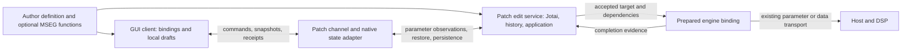

# Independent Builder Kit state module sketch

Proposed design only; not implemented or qualified. Source inspected on `master` at `44f179fd`. Existing changes were preserved. I did not read the earlier architecture proposals in this directory or the rejected dynamic-data research directory. All new symbols and paths below are **proposed**.

## Decision

Use one **patch-lifetime edit service backed by Jotai vanilla**, plus a small GUI client. The service owns editable complex values, the shared history, engine-application progress, and the interpretation of commands. The GUI client owns a read-only projection and short-lived local drafts for immediate drawing. The native host remains authoritative for actual scalar parameter values and persistent patch storage.

The user has explicitly welcomed adding a command channel. The channel is justified by the whole coordination problem, not solely by optional history persistence:

| Choice | Cost and behavior |
| --- | --- |
| GUI-local Jotai/history + stored-state worker | Can clear history on GUI destruction and restore native values. Requires separate GUI history/publishing, stored-write identity and echo handling, status request/replay, restore synchronization, and a close handoff if the latest accepted edit must outlive the view. |
| Patch-lifetime Jotai/history + GUI projection | Requires command/reply/snapshot/detach routing and a local draft overlay. Gives one place for command ordering, history, data preparation, restore policy, and accepted state when a GUI disappears. |

Choose the second. Once restore, asynchronous application, and teardown are explicit, its coordination is more cohesive. A command channel alone would not solve scalar echo provenance; the design preserves that distinction below.

**Minimum history policy:** keep up to 100 completed entries in this patch-service lifetime. Closing an MSEG drawer, unmounting a control, or closing/reopening the whole GUI does not discard that history. Replacing a preset/document or recreating the patch worker clears it. History is not serialized in the DAW project and does not survive application restart. Persisting history, collaborative merge semantics, atomic multi-field DSP installation, and crash durability are not required.

## Four collaborating modules



The definition is immutable configuration. The four live collaborators are:

| Module | Responsibility and placement | Creator / lifetime |
| --- | --- | --- |
| `plugin-state-session.ts` | The edit service: native Jotai store/atoms, validation, gesture/history policy, command queue, accepted-output ordering | Generated patch-worker composition; patch lifetime |
| `plugin-state-client.ts` plus thin `plugin-state-react.tsx` | GUI projection, pending edit drafts, receipt reconciliation, hooks/control bindings; no durable state or history calculation | View factory; whole GUI lifetime |
| `plugin-state-cmajor.ts` plus framework channel glue | Parses/projections for native state and the GUI/service channel; host parameter methods, storage, restore epochs, native view detach | Framework native/browser patch connection lifetime |
| `plugin-state-engine.ts` | Reusable preparation/application ownership, latest-target invalidation, typed results and transport-specific acknowledgement | Edit service creates one binding per declared data application; patch lifetime |

This is not four independent copies of the document. The service's Jotai atoms contain the desired complex values and user edit history. The GUI base is a read-only projection; its drafts are explicitly unaccepted requests. The engine binding holds a captured preparation input/output and progress, not an editable model. Native stored state is the persistent representation of accepted values. Scalar service fields are observations/intents around host-owned parameters; they are never a second persisted parameter bank.

**History is a small pure policy inside `plugin-state-session.ts`**, or a private sibling file if size warrants it. It is not a fifth live collaborator and has no subscriptions, transport, persistence, or lifecycle of its own. Its inputs are accepted changes/gesture boundaries and its outputs are before/after entries and Undo/Redo decisions.

## Author definition and actual GUI use

```ts
// fx/example/state.ts — immutable definitions, build-discovered by the kit
import { definePluginState, parameter, storedValue } from "../../kit/ui/plugin-state-definition";
import { eventValue } from "../../kit/ui/plugin-state-cmajor";
import { defaultCurve, curveCodec, renderCurve } from "../../kit/ui/mseg/curve";
import { waveReferenceCodec, prepareWave } from "./wave";

export const pluginState = definePluginState({
  gain: parameter("gain"),
  rate: parameter("rate"),
  curve: storedValue({
    initial: defaultCurve(), codec: curveCodec,
    engine: eventValue("curveBuffer", renderCurve),
  }),
  wave: storedValue({
    initial: { kind: "resource", path: "waves/default.wav" },
    codec: waveReferenceCodec,
    engine: eventValue("waveBuffer", prepareWave),
  }),
});
```

`parameter` refers to an existing host parameter. Endpoint metadata and an actual host snapshot supply its range/step/default/current value; hook defaults are not host truth. `eventValue` is the supplied **send-only** Cmajor adapter: it executes the ordinary non-React preparation function and sends its result. Authors create no workers and send no messages. A different supplied engine adapter can install the same domain value through an acknowledged endpoint protocol or native buffer transport.

```tsx
export function ExampleView() {
  const gain = usePluginState(pluginState.gain);
  const curve = usePluginState(pluginState.curve);
  const history = usePluginHistory();
  return <>
    <Knob binding={gain} />
    <MsegEditor binding={curve} />
    <button disabled={!history.canUndo} onClick={history.undo}>Undo</button>
    <button disabled={!history.canRedo} onClick={history.redo}>Redo</button>
    <ApplicationStatus value={curve.application} />
  </>;
}
export default createStatefulPatchView({ definition: pluginState, View: ExampleView });
```

The binding exposes `value`, `isReady`, `setValue`, `beginGesture`, `endGesture`, and `application`. `setValue` validates and draws locally immediately; the client owns the resulting pending command and exposes an edit rejection through the binding. Local drawing is not an acceptance receipt. The same client offers its Jotai store/read atoms for a non-React GUI; there is no additional observable implementation.

The optional MSEG component owns hit testing, selection, pointer capture, and visual orientation. Pure curve operations/preparation live separately in `kit/ui/mseg/curve.ts`. It uses the shared gesture/history binding and has no independent Undo stack, storage connection, or worker. A/B morphing is a composition of two curve fields and a parameter field, not a requirement on every curve. Rate remains an ordinary host parameter. Waveform PCM/cache data lives in the engine binding; the editable value is an immutable durable asset reference. Imported-asset retention is a separate resource-adapter responsibility; the first implementation can support bundled resources without inventing a complete asset library.

## Typed interfaces and evidence

```ts
type Result<T, E> = { readonly kind: "ok"; readonly value: T }
  | { readonly kind: "error"; readonly error: E };
type Ready = { readonly kind: "pending" }
  | { readonly kind: "ready" }
  | { readonly kind: "failed"; readonly reason: "missing-capability" | "invalid-state" | "initial-read-failed" | "service-closed" };
type InputError = { readonly kind: "invalid-value"; readonly message: string };
type DeliveryError = { readonly kind: "resource" | "transport" | "engine-rejected" | "cancelled";
  readonly message: string };
type OwnerEpoch = string;
type DocumentEpoch = number;
type ClientId = number; // assigned by native/browser channel, not by component authors
interface Target {
  readonly owner: OwnerEpoch;
  readonly document: DocumentEpoch;
  readonly generation: number; // changes when this binding's value or dependencies change
}
interface ValueCodec<T> {
  parse(value: unknown): Result<T, InputError>;
  encode(value: T): unknown; // storage adapter enforces its actual JSON/CHOC contract
  equals(left: T, right: T): boolean;
}
type Evidence =
  | { readonly kind: "sent"; readonly proof: "connection-call-returned" }
  | { readonly kind: "acknowledged"; readonly transport: string;
      readonly engineSession: string; readonly operation: string };
type Application =
  | { readonly kind: "waiting-for-inputs" | "pending" | "preparing" }
  | Evidence
  | { readonly kind: "failed"; readonly error: DeliveryError };
type Persistence = { readonly kind: "host-managed" }
  | { readonly kind: "pending" | "observed-in-native-state" }
  | { readonly kind: "failed"; readonly error: DeliveryError };
interface FieldSnapshot<T> {
  readonly value: T;
  readonly readiness: Ready;
  readonly application: Application;
  readonly persistence: Persistence; // host-managed for scalar fields
}
interface CommandAddress {
  readonly client: ClientId;
  readonly sequence: number;
  readonly owner: OwnerEpoch;
  readonly document: DocumentEpoch;
}
type Command =
  | { readonly kind: "begin"; readonly key: string; readonly label: string }
  | { readonly kind: "edit"; readonly key: string; readonly value: unknown }
  | { readonly kind: "end" }
  | { readonly kind: "undo" | "redo" };
type CommandResult = { readonly kind: "accepted"; readonly revision: number }
  | { readonly kind: "rejected"; readonly reason: "not-ready" | "stale-document" | "invalid-value" | "closed-client" | "service-closed" }
  | { readonly kind: "interrupted"; readonly reason: "service-closed";
      readonly acceptance: "unknown" };
interface CommandReceipt {
  readonly address: CommandAddress;
  readonly result: CommandResult;
}
```

Input readiness, local acceptance, native-state observation, and DSP evidence are separate. A void `sendEventOrValue` returning does not prove enqueue success or DSP application. A normal `param_value` callback is an observation of host parameter state, not a matching operation receipt. An acknowledged adapter must return its actual matched engine session/operation. A saved DAW project on disk is beyond `observed-in-native-state`.

All raw commands, native snapshots, and transport replies are parsed at the channel/adapter seam. Startup fails visibly when required capabilities or declared endpoints are missing; invalid stored values are `failed`, not silently replaced by defaults. A data field absent from an otherwise valid native snapshot uses its declared initial value and a real service target `{owner, document, generation: 0}`. Absence therefore does not need a made-up persisted write ID. Edits and Undo/Redo are rejected while their affected fields are not ready; initialization failure does not masquerade as a ready default.

## The channel and native-state contract

The current Cmajor API needs an explicit framework extension. The proposed channel has these **named sender/receiver pairs**:

| Sender → receiver | Message and responsibility |
| --- | --- |
| Edit service → native-state adapter | `open(declared endpoints and stored keys)`; register owner observations first, then return one current native snapshot/epoch or a typed initialization failure |
| GUI client → native channel → edit service | `attach`; channel registers the view first; service returns an atomic current `snapshot` |
| GUI client → native channel → edit service | `command(address, command)`; native stamps/checks the current document epoch and routes in client sequence order |
| Edit service → native channel → GUI clients | `update(revision, snapshot, optional command result)`; snapshot includes history and application status; origin client consumes its receipt |
| Edit service → native-state adapter | `publish(expectedDocumentEpoch, operation, changes)` using existing parameter/gesture/stored-state APIs internally |
| Native-state adapter → edit service | `publicationResult(operation, epoch, result)` and parsed `parameterObserved` events; no user history is inferred from observations |
| Native host → edit service | `documentReplaced(newEpoch, completeSnapshot)` after host preset/full-state replacement |
| Native view lifecycle → edit service | `detach(owner, document, client, routedThrough)` after the last command already routed from that view in that sequence scope |
| Native channel → GUI clients | Authoritative `ownerChanged`/`documentReset` control, followed by a fresh attach/replacement snapshot; only these controls can advance the client's epoch |

`attach` includes readiness/status/history in the same snapshot as values; there is no separate subscription-then-status hydration gap. All updates carry owner epoch, document epoch, and increasing service revision. The GUI listener is installed before `attach`; until the first snapshot it buffers the newest update from the expected epoch. It ignores a lower snapshot revision from the same epoch. It adopts epochs only from the current native attach handshake or authoritative native `ownerChanged`/`documentReset` controls; an arbitrary late update with a different epoch cannot become a new reset. A native reset clears drafts immediately, enters pending readiness, and requests/awaits the matching service snapshot. The framework assigns a new owner epoch when constructing a new service. This is session identification, not an asset version or engine acknowledgement.

Every receipt/rejection includes its full `CommandAddress`. The GUI processes a matching receipt independently of whether that message's snapshot revision is newer: remove that exact command's pending draft, retain newer pending drafts, and resolve its local ticket. A per-field acknowledged-sequence floor prevents an older still-pending draft from becoming visible after a newer same-field edit was acknowledged. Receipts from an old owner/document or another client cannot settle this client's tickets. A fresh explicit reset settles old-epoch tickets using the acceptance rules below and clears their drafts. Incoming JSON snapshots reuse the previous immutable field value when its codec reports equality, and reuse unchanged metadata before one coherent projection update. Thus scalar automation does not give unchanged MSEG objects new identities on every message.

Sequences are scoped to `(owner, document, client)`. An authoritative owner/document reset sets the GUI's next sequence, native `routedThrough`, and service expected sequence back to zero for the new scope; the first command there is 1. Commands remain disabled until the new handshake/snapshot is ready. Old-scope messages cannot advance new-scope counters. Thus rejecting an old-document sequence does not leave an unfillable hole after reset. A reset/close settles GUI-local tickets: an unsent draft is rejected, a known receipt keeps its result, and a sent request with no definitive receipt is interrupted with unknown acceptance. It is not automatically replayed in the new document.

The native channel extends `Patch::handleClientMessage` with a `kit_state` envelope, checks that service-originated messages come from the actual patch-worker `PatchView`, and routes through existing `sendMessageToView`/`broadcastMessageToViews`. Client commands are never stored as patch state. A native accepted/routed command is retained independently of the originating GUI; removing a view does not delete work already queued for the patch service. No browser `postMessage` API is assumed inside native QuickJS.

Native pseudocode for the new routing responsibilities:

```cpp
onClientStateMessage(sourceView, message) {
    if (sourceView == currentPatchWorker)
        routeServiceReplyOrGuardedPublication(message);
    else if (auto client = clients.find(sourceView))
        if (message.owner == currentOwnerEpoch && message.expectedDocumentEpoch == documentEpoch)
            if (message.sequence == client.routedThrough + 1) {
                client.routedThrough = message.sequence;
                routeToWorker(client.id, message.sequence, message, documentEpoch);
            } else
                sendSequenceRejection(sourceView, message.sequence);
        else
            sendStaleDocumentReply(sourceView, documentEpoch);
}
onOwnerOpen(declaration) {
    registerOwnerObservationStream(declaration);
    replyInitialSnapshot(documentEpoch, captureDeclaredState());
}
onViewRemoved(view) {
    auto client = clients.remove(view);
    if (client)
        routeToWorkerDetach(client.id, client.routedThrough);
}
onFullStateReplacement(newState) {
    ++documentEpoch; // invalidates old publications before any replacement mutation
    resetClientSequenceScopes(documentEpoch);
    sendDocumentResetControls(documentEpoch);
    suppressOwnerParameterAndStoredNotifications = true;
    applyUsingExistingSetFullStoredState(newState);
    suppressOwnerParameterAndStoredNotifications = false;
    routeToWorkerDocumentReplaced(documentEpoch, captureDeclaredState());
}
onOwnerPublication(message) {
    if (message.expectedDocumentEpoch != documentEpoch)
        return replyStaleDocument(message.operation);
    // Parse whole publication before changing anything. Use existing host methods.
    applyParameterGesturesAndValues(message.parameters);
    applyStoredValues(message.data);
    replyPublicationObserved(message.operation, documentEpoch);
}
onParameterFIFOEvent(endpoint, queuedValue) {
    // The existing ordinary param_value broadcast may retain queuedValue.
    // The NEW owner stream reads current native parameter state at dispatch.
    auto current = findDeclaredPatchParameter(endpoint)->currentValue;
    routeToWorkerParameterObserved(documentEpoch, endpoint, current);
}
```

Those pseudocode operations are adapter responsibilities, not additional service modules: `routeToWorker*` calls `Patch::sendMessageToView` on `renderer->patchWorker`; `captureDeclaredState` reads current declared `PatchParameter` values plus `getFullStoredState().values`; `applyUsingExistingSetFullStoredState` is the existing native setter; parameter application uses existing `sendGestureStart`, `sendEventOrValueToPatch`, and `sendGestureEnd`; data application uses `setStoredStateValue`. The owner-open request supplies the finite endpoint/key descriptor, so native code does not import TypeScript codecs. Observation registration and native snapshot capture occur in the same serialized patch message context, followed by later observations; the browser implementation supplies an equivalent worklet fence. The reply means those native methods processed the publication, with typed failure if a requested send failed. It does not claim an audio-block-wide transaction.

**Restore interception is required framework work**, at the actual `Patch::setFullStoredState`/reset entry point used by the wrapper, not just the GUI preset button. Existing ordinary GUI parameter listeners keep their behavior; suppression applies to the new edit-owner stream, whose single replacement snapshot supplies final values. Suppression alone is insufficient because Cmajor queues parameter payloads in a FIFO and broadcasts them later (`cmaj_Patch.h:470–490`). The new owner observation stream therefore reads the current declared `PatchParameter.currentValue` at native dispatch, rather than stamping an old queued payload with the new epoch. An old notification after restore becomes a duplicate observation of current state, not a replay of pre-restore data. This does not assert a general scalar edit/automation origin guarantee. Owner-originated stored writes are tagged in this adapter's synchronous mutation scope and their echoes are confirmation only. An external raw change to a registered complex key produces a parsed field-replacement event and clears history; it is not guessed to be an owner echo. Unknown/late old-epoch publication replies are ignored.

Every owner-originated parameter/data send also carries the expected document epoch through the native adapter, including sends from engine bindings. The native receiver checks it immediately before enqueueing. This prevents a delayed old-epoch worker send from overwriting a new host restore even if the worker has not received the replacement notification yet. Sends already handed to the engine before replacement cannot universally be recalled; the restored binding is replayed afterward.

Browser mode implements this same contract in the patch connection: currently `startPatchWorker` invokes a module in the same JS realm. Calls may therefore be local, while audio parameter observation goes through the AudioWorklet. Its full-state replacement path adds an explicit worklet fence/snapshot response before emitting `documentReplaced`; cached complex values and final scalar observations form one replacement snapshot. A real background browser Worker is an optional execution adapter. The common contract must be tested in both paths rather than inferred from the experiment's browser Worker.

## Atomic command coordination, using Jotai for reactivity

The edit service has one `modelAtom` and derived field/history atoms. The model holds immutable field values, readiness, history, active gesture and status. Changes retain only affected immutable value references. Jotai supplies store reads, derived reads and notification batching; there is no listener registry or custom dependency graph for local reactivity.

Only `dispatch` may change the model. Native observations, commands, engine completions, restore, and detach all enter that one queue. Read subscribers can enqueue another command but cannot execute one recursively. History, values, target generations, and pending status change in one Jotai write. The explicit effects returned by the accepted transition are dispatched before the next queued command. Subscribers are never treated as a command/history journal.

```ts
const modelAtom = atom(initialModel);
const transitionAtom = atom(null, (get, set, event: ServiceEvent) => {
  const result = transition(get(modelAtom), event);
  if (result.kind === "accepted") set(modelAtom, result.model); // one atomic local commit
  return result;
});
type QueueItem = { event: ServiceEvent; finish: (result: DispatchResult) => void };
const queue: QueueItem[] = [];
let draining = false;
let closed = false;
let activeItem: QueueItem | null = null;
let activeResult: DispatchResult | null = null;

function dispatch(event: ServiceEvent): Promise<DispatchResult> {
  if (closed) return Promise.resolve(serviceClosedResult(event));
  return new Promise(finish => {
    queue.push({ event, finish });
    drainCommands();
  });
}
function drainCommands() {
  if (draining) return;
  draining = true;
  try {
    while (queue.length !== 0) {
      const item = queue.shift();
      if (item === undefined) break;
      activeItem = item;
      const result = store.set(transitionAtom, item.event);
      activeResult = result; // preserve known acceptance even if a later effect/channel step defects
      if (result.kind === "accepted") {
        for (const effect of result.effects) {
          switch (effect.kind) {
            case "native-publication":
              native.publish(effect, completion => { enqueueCompletion(completion); });
              break;
            case "engine-target":
              bindings.at(effect.key).replace(effect.input, effect.target);
              break;
            case "cancel-engine-target":
              bindings.at(effect.key).cancel();
              break;
          }
        }
        channel.sendUpdate(snapshot(store.get(modelAtom)), result.receipt);
      } else channel.sendRejection(result.receipt);
      item.finish(result);
      activeItem = null;
      activeResult = null;
    }
  } catch (cause: unknown) {
    closeOnDefect(cause);
  } finally { draining = false; }
}
function enqueueCompletion(event: ServiceEvent) {
  if (closed) return;
  // Same queue, but completion producers don't need a public command receipt.
  queue.push({ event, finish: () => {} });
  drainCommands();
}
function closeOnDefect(cause: unknown) {
  closed = true; // reentrant dispatches during failure notification reject immediately
  diagnostics.defect(cause);
  const unstarted = queue.splice(0);
  if (activeItem !== null) {
    activeItem.finish(activeResult ?? interruptedResult(activeItem.event));
  }
  activeItem = null;
  activeResult = null;
  // Only requests known not to have started can be rejected as having made no change.
  for (const item of unstarted) item.finish(serviceClosedResult(item.event));
  for (const binding of bindings.values()) binding.cancel();
  try { store.set(serviceClosedAtom, true); } catch (failure) { diagnostics.defect(failure); }
  channel.close({ reason: "service-closed" });
}
```

Here `native.publish` owns the native pending request and converts both send failure and reply into the supplied completion callback; it never throws an expected I/O failure or returns an unowned promise. `channel.sendUpdate/sendRejection/close` similarly own routing errors and cannot synchronously invoke a model mutation. `snapshot` is a fixed projection of the model (values/readiness/history flags/status/revisions), with no behavior. `bindings.at` is the finite definition's registered engine binding. `serviceClosedResult` returns a rejection carrying the original command address and `service-closed` for an unstarted command; a native/internal event receives a `service-closed` dispatch result without a GUI receipt. `interruptedResult` carries the original address and unknown acceptance when a defect interrupted the active transition before a result was recorded. Known accepted results remain accepted even if a later effect fails; nothing claims rollback. `serviceClosedAtom` marks lifecycle/readiness failed in one write and is the sole defect-path exception to ordinary transitions. The GUI also marks readiness failed on channel close, even if the defective store could not notify, and settles all its unresolved sent tickets as interrupted rather than assuming rejection. The diagnostic sink and channel-close contract are non-throwing. No active or queued command is left waiting, and later dispatches reject. Expected failures still use ordinary events/results.

`transition` is the small **application history policy**, not a replacement state library. Its complete rules are:

```ts
// All operations below construct one next Model and one ordered effect list.
// Model is never mutated by a subscriber, adapter, or engine task.
transition(model, event):
  reject command if client closed, epoch stale, sequence invalid,
    or any affected field not ready;
  parse/normalize all proposed values before constructing the next model;
  begin: finish prior gesture; capture current before-value and client/key/label;
    emit ordinary parameter gesture-start if field is a parameter;
  edit: finish the active gesture first if client or key differs, including one-shot setValue;
    replace the value; update the matching gesture's after-value or add one completed entry;
    clear redo only for an actual new user edit; increment affected target generations;
    set native persistence/application pending; return publication and engine-target effects;
  end: finish matching client's gesture; append one non-empty before/after entry;
    emit ordinary parameter gesture-end; no extra engine send just for releasing;
  undo/redo: finish active gesture; move an entry between past/future;
    restore its before/after values; use the same publication/engine effects as edit;
    bracket scalar restored writes with ordinary host gestures;
  parameterObserved: update the observed scalar (no history, no scalar resend);
    rebuild only engine bindings that explicitly declare this parameter dependency;
  nativePublicationResult: update persistence/sent evidence only if epoch/operation match;
    never replay a stored echo as an edit;
  engineCompletion: update application only if Target matches the current binding target;
  initialNativeState: parse the complete observation, mark declared fields ready or failed,
    use initial values only for absent data keys, and schedule ready generation-0 targets;
  initializationFailure: mark the affected readiness failed and reject dependent commands;
  documentReplaced: cancel active work/gestures, clear history, install parsed complete state,
    adopt new document epoch, reset each client's sequence scope, and schedule fresh targets;
  externalComplexFieldReplaced: replace parsed value, finish gestures, clear history,
    and schedule the affected targets;
  detach(client, routedThrough): finish that client's active gesture after its routed prefix;
    remove client, retain accepted model/history/work;
```

These rules require a few pure helpers for the history entry's before/after references and no general reducer framework. Completed entries keep only affected immutable references; history is capped after append. A net-zero completed gesture adds no entry. One active gesture per service is the initial policy: a new gesture ends the previous one. Multiple GUIs can read; overlapping writes are serialized by arrival, without pretending to provide collaborative merge semantics. Closing a drawer just sends `end`; only actual GUI destruction sends native `detach`.

For scalar fields the service also retains the latest authoritative host observation separately from its current user request. The first history baseline is that observed value, never a hook fallback. Host callbacks do not become history or change an active gesture's requested after-value. Undo reasserts a prior absolute value through the normal host API; automation may override it on its next update. The displayed value while dragging is the GUI draft; outside the draft it follows the latest service/host observation. Native correlation cannot be inferred by equal-value comparison. Perfect suppression of visually stale scalar echoes requires a provenance/current-snapshot guarantee from the native adapter and remains a distinct optional refinement, not a claim made by the command channel.

## Preparation and the last actual-send seam

A preparation receives an immutable snapshot containing its declared data value plus explicitly declared parameter/context dependencies. `eventValue` defaults to no dependencies. An optional binding definition can list parameter IDs and engine context values such as sample rate. The edit service registers those native subscriptions, waits for them to become ready, and changes the binding target generation whenever an input changes. Authors still write ordinary preparation functions. This fixed dependency list is sufficient; there is no universal dependency-graph scheduler.

```ts
interface PreparationContext { readonly signal: AbortSignal; readonly resources: ResourceReader }
type Prepare<I, P> = (input: I, context: PreparationContext) =>
  Result<P, DeliveryError> | Promise<Result<P, DeliveryError>>;
interface SendPermit {
  readonly signal: AbortSignal;
  // Synchronous check around the LAST actual handoff, after all adapter awaits.
  send<T>(action: () => T): Result<T, { readonly kind: "superseded" }>;
}
interface EngineTransport<P> {
  apply(payload: P, permit: SendPermit): Promise<Result<Evidence, DeliveryError>>;
  stop(): void; // settles its owned waits as cancelled
}
```

The framework supplies the cancellation implementation in each runtime; it must not assume native QuickJS provides the browser global `AbortController`. Resource reads and transport waiters honor that contract. Pure computation can finish and be discarded; cancellation is not a claim that arbitrary synchronous JS can be preempted.

```ts
function createEngineBinding<I, P>(prepare, transport, resources, complete, diagnostics, cancellation) {
  let wanted: { input: I; target: Target; generation: number } | null = null;
  let generation = 0;
  let stopped = false;
  let running: Promise<void> | null = null;
  let active: RuntimeCancellation | null = null;
  let lastTarget: Target | null = null;

  function replace(input: I, target: Target) {
    lastTarget = target;
    if (stopped) { complete(target, unexpectedDeliveryFailure); return; }
    wanted = { input, target, generation: ++generation };
    active?.cancel();
    kick();
  }
  function kick() {
    if (stopped || running !== null || wanted === null) return;
    running = drain().catch((cause: unknown) => {
      diagnostics.defect(cause);
      if (lastTarget !== null) complete(lastTarget, unexpectedDeliveryFailure);
      stopped = true;
      active?.cancel();
      transport.stop();
    }).finally(() => {
      running = null;
      if (!stopped && wanted !== null) kick(); // no lost wakeup after promise settlement
    });
  }
  async function drain() {
    while (!stopped && wanted !== null) {
      const work = wanted;
      wanted = null;
      const scope = cancellation.create(); // explicit runtime dependency
      active = scope;
      const current = () => !stopped && work.generation === generation && !scope.signal.aborted;
      const permit: SendPermit = {
        signal: scope.signal,
        send: action => current() ? { kind: "ok", value: action() }
                                  : { kind: "error", error: { kind: "superseded" } },
      };
      const prepared = await cancellation.settle(
        prepare(work.input, { signal: scope.signal, resources }), scope.signal);
      if (!current()) continue;
      if (prepared.kind === "error") { complete(work.target, prepared); continue; }
      const result = await transport.apply(prepared.value, permit);
      if (current()) complete(work.target, result);
      active = null;
    }
  }
  return {
    replace,
    cancel() { ++generation; wanted = null; active?.cancel(); },
    async stop() {
      stopped = true; ++generation; wanted = null;
      active?.cancel(); transport.stop();
      await running;
    },
  };
}
```

`complete` enqueues an `engineCompletion` event in the edit service. `diagnostics` is an injected defect sink. `unexpectedDeliveryFailure` is a fixed safe transport failure, not a serialized raw exception. `cancellation` is the injected runtime adapter with `create` (signal/cancel) and `settle` (race work with cancellation, always attach handlers to late results). Its implementation resolves `cancelled` immediately when the signal aborts, removes its abort listener when work settles, and retains fulfillment/rejection handlers for late work so a cancelled resource promise cannot reject unhandled. `RuntimeCancellation` is exactly `{signal: AbortSignal, cancel(): void}`. `prepare`, resource I/O, and transport adapters return typed expected failures; a thrown defect stops the binding. No `PatchWorkerServiceHost` task runner is assumed.

The ordinary Cmajor event transport uses the permit at the actual send:

```ts
async function applyEvent(payload, permit) {
  const sent = permit.send(() => native.sendEventOrValue(expectedDocumentEpoch, endpoint, payload));
  if (sent.kind === "error") return cancelledOrSuperseded;
  return sent.value; // native adapter's typed send result, including a synchronous failure
}
```

`native.sendEventOrValue` is the checked, epoch-guarded adapter over the existing connection method, not an optional no-op. Its return type is `Result<Evidence, DeliveryError>`; the success value here is `{kind: "sent", proof: "connection-call-returned"}`. It classifies a synchronous send failure. Returning from it proves only a send call; it does not imply DSP application. A transport that can report accepted enqueue may add that distinct evidence without redefining `sent`.

For an acknowledged transport, the final-send guard is **inside** the adapter after readiness/baseline waits:

```ts
await lane.ensureBaseline(permit.signal);
for (const command of preparedCommands) {
  const sent = permit.send(() => lane.sendActualCommand(command));
  if (sent.kind === "error") return cancelledOrSuperseded;
  const ack = await lane.waitForMatchingSessionAndSerial(permit.signal);
  if (ack.kind === "error") return ack;
}
return matchingEngineAcknowledgement;
```

This is the required seam change when adapting today's `RuntimeInstallLane`: checking only before `sendBatch` is insufficient because `sendBatch` awaits its session baseline before actual sends. Thread the permit/cancellation through that lane to its `connection.sendEventOrValue` call. The adapter's actual matching acknowledgement provides the engine session/serial; do not fabricate a receipt from an arbitrary status event. Its existing modulation-before-articulation ordering remains product-specific, outside the generic history policy. Already-sent data cannot necessarily be recalled. Atomic installation, chunking, memory ownership, and DSP supersession gates belong to the selected transport and are not universal requirements.

## End-to-end traces

**Curve drag and Undo.** The GUI client is attached to the service snapshot. Pointer-down calls `beginGesture`; the client queues it on the native channel. Every pointer move uses pure MSEG math, parses the resulting shape, writes a local draft atom immediately, and queues `edit` with the next client sequence. Native routes those commands independently of the view's later lifetime. The service queue parses each command, updates its Jotai value/history checkpoint/pending target in one transition, publishes the compact desired curve to native stored state, and replaces the engine binding's target before moving to the next command. It then emits a snapshot/receipt. The client replaces its read-only base, drops drafts acknowledged through that receipt, and retains any newer draft. Pointer-up ends one history entry. Undo goes through that same service queue, restores its prior curve in one transition, and uses the same native publication and engine-target path. There is no parallel GUI history algorithm.

**Engine completion and automation.** Preparation finishes in the patch service's execution environment. If its value/dependencies were superseded, its permit refuses the next actual send. Otherwise the engine adapter sends. In an acknowledged adapter, DSP emits the session/serial acknowledgement; native endpoint routing delivers it to the worker listener; the adapter matches it and returns evidence. The binding enqueues completion; the service accepts only the matching current Target and updates the application atom in one transition; the channel sends the new snapshot to the GUI. The default event adapter instead yields `sent`, never `acknowledged`. Separately, a host automation value arrives through native parameter observation; the service updates its observed scalar, makes no history entry and no echo send, and invalidates only explicitly dependent preparations. Ordinary scalar sends and gesture brackets continue using the existing host methods.

**Close, reopen, and restore.** Native view teardown routes `detach` after that view's already-routed command prefix. The service finishes its active gesture and keeps accepted state/history/preparation; the GUI's drafts and listeners disappear. A later attach receives one atomic snapshot of current values, history, readiness and application status. A locally drawn draft that never reached native is unaccepted and has no survival guarantee; an accepted service command survives GUI closure even if its native persistence receipt is still pending, because its owner remains alive. If native storage fails, that failure remains visible on reopen. A full host restore is different: native increments document epoch before applying state, rejects later old-epoch publications/sends, emits one parsed replacement snapshot after the existing setter completes, and the service clears history, cancels old targets and recomputes fresh ones. Old command receipts, own storage echoes and engine completions cannot cross that epoch. No old acknowledgement is reused on worker recreation.

## Existing code to reuse and actual framework work

- Keep `kit/ui/cmajor-react.ts:144–297` host baseline/listener/request/gesture behavior. Extract its non-React host mechanics into the state adapter; do not run the old hook as a second writer for a field managed by this facility.
- Deepen `kit/ui/stored-state-runtime-mirror.ts` into the common engine binding mechanics, with honest result types, explicit last-send currentness and lifecycle ownership. Do not run both implementations for the same stored key. Its default `lastAppliedSnapshot` is currently send-only evidence.
- Use `kit/ui/patch-worker-services.ts` for service composition. Build discovery currently requires `workerSource` (`kit/fx/build-effect.mjs:1115–1130`); framework work discovers `state.ts` and emits a composed entry automatically. Existing custom workers can be composed once with it. Retain the returned service host for actual browser patch teardown; the current browser helper ignores the worker return value. Native renderer teardown destroys its separate worker context.
- Extract optional MSEG curve/editor pieces rather than import `mseg-controller.ts`, all of `synth-components.tsx`, or all of `synth-hooks.ts`. Current Rate ownership is explicit in `modulation.ts:1346–1348` and `synth-hooks.ts:3218–3228`.
- Preserve real acknowledgement logic in `runtime-install-channel.ts:15–39,287–334,478–501` and the specialized sequencing in `modulation-articulation-worker-service.ts:304–324`.
- The Jotai experiment's native atom/write/store/subscription shape and affected-reference history are useful. Its `contract.ts` is explicitly a test driver; browser `Worker` requests in `worker.ts`/`browser-ui.tsx` are not native Cmajor messages. The `PreparedDelivery` fixture does not prove an installed engine transaction.
- Cached Cmajor `cmaj_Patch.h:745–829,1666–1673,2618–2645` establishes patch-worker lifetime. Its `handleClientMessage:2779–2910` has no arbitrary relay. `cmaj_PatchWorker_QuickJS.h:147–209` constructs a separate worker connection. Browser `cmaj-audio-worklet-helper.js:756–763` invokes its worker module in the current realm. Add the channel through the supported framework runtime source/patch path; do not edit the cache.

The remaining work is implementation and proof, not an open ownership policy: add the narrow native/browser channel/restore hooks, implement the four modules, and validate the real runtime seams. Required focused cases are atomic command observation, reentrant command submission ordering, grouped edit/Undo, automation without echo, invalid boot values, absent defaults, attach while preparation finishes, supersession while an acknowledged lane waits for baseline, cancellation/teardown, detach after routed edits, and host full restore with queued old work. Then qualify in native QuickJS/Cmajor and browser runtimes. Existing library experiments do not establish these production integration or audible-live-update results.
